# Lab 01 - Configure Sensitive Labels 

## Lab scenario

Microsoft Purview Information Protection's Sensitivity labels empower you to classify and secure your organization's data, ensuring that user productivity and collaboration remain unimpeded.

In a Contoso company, john uses Microsoft Purview's Sensitivity labels to safeguard "Project Quantum Leap" data. With labels like "Confidential-Finance"  employees effortlessly classify and share information securely. When Alex mistakenly attempts to share a sensitive document, Purview intervenes, preventing potential data exposure. The organization thrives as Sensitivity labels balance robust data protection with seamless collaboration.

## Lab objectives

In this lab, you will complete the following tasks:

+ Task 1: Explore the capabilities of sensitivity labels
  
## Architecture diagram

### Task 1: Explore the capabilities of sensitivity labels

In this task you will understand how to create Sensitivity labels and how it lets you to classify and protect your organization's data.

1. If you not already login to admin center, in the address bar of Microsoft edge enter **admin.microsoft.com**(https://admin.microsoft.com/).

1. Sign in with your admin credentials.
   
1. In the Sign in window you will see a login screen, in that enter the following email/username and then click on **Next**. 

    * Email/Username: <inject key="AzureAdUserEmail"></inject>

1. Now enter the password and click on Sign in.
   
   * Password: <inject key="AzureAdUserPassword"></inject>
  
1. When prompted to stay signed-in, select **Yes**. This takes you to the Microsoft 365 admin center page.

1. From the left navigation pane of the Microsoft 365 admin center, select **Show all**.

    

1. Under Admin centers, select **Compliance**. a new browser page will open, navigates you to the Microsoft Purview welcome page..  

    
    
    

1. From the left navigation panel of the Microsoft Purview, under Solutions, Expand **Information protection** and in the dropdown select **Overview** and review the information.

1. From left menu select **labels** and in the yellow information box, indicates that Your organization has not turned on the ability to process content in Office online files that have encrypted sensitivity labels applied and are stored in OneDrive and SharePoint.  Select **Turn on now**.  Once you do this, there can be a delay for the setting to propagate through the system.

1. On **Labels** tab from the dropdown and then select **+ Create a label**

    .png)

1. Provide a name and description for your label. Select **Next** at the bottom of the page.

    | Setting | Action |
    | -- | -- |
    | **Name** text box | Enter **Confidential-Finance** |
    | **Display name** text box | Enter **Confidential-Finance** |
    | **Description for users** text box | Enter **Confidential-Finance Demo** | 

    !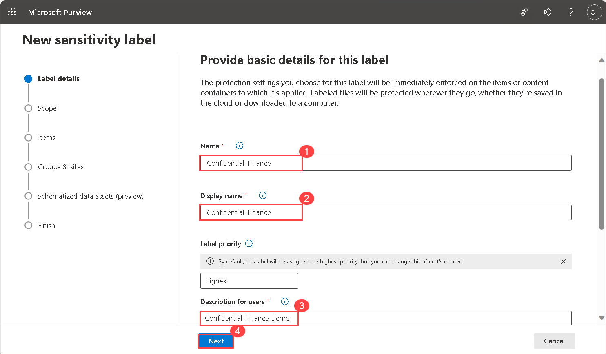

1. Note the scope for this label.  The scope is set to **Items**.  Read the description but don’t change anything.  Select **Next** at the bottom of the page.

      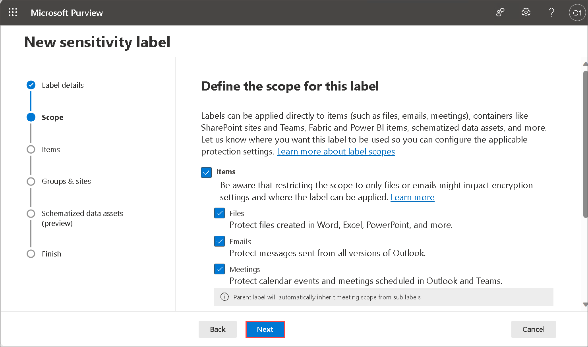

1. On the Choose protection settings for labeled items select the **Apply or remove encryption** and **Apply content marking**, then select **Next**.

    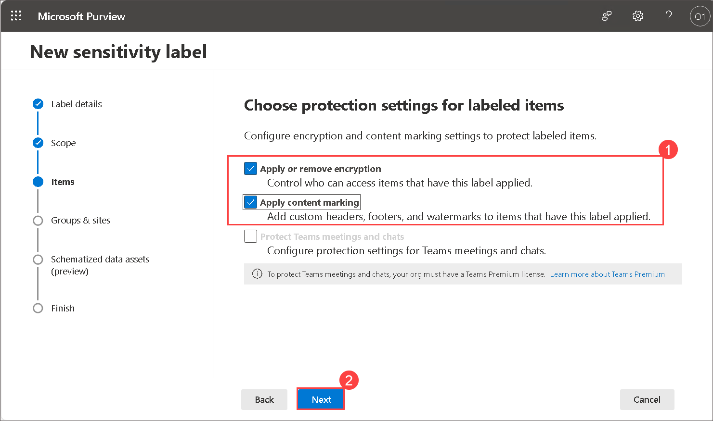
    
1. The Encryption window shows the configuration for the encryption settings. Review the information box under Configure encryption settings and review the configured settings. Notice how the user access to content is set to never expire.  You can also assign permissions to specific users and groups By clicking on the **Assign permission**. On the **Assign permission** click on **+ Add Users or Groups**. 
    
    

1. Select your **user name**  and click on **Add**.

   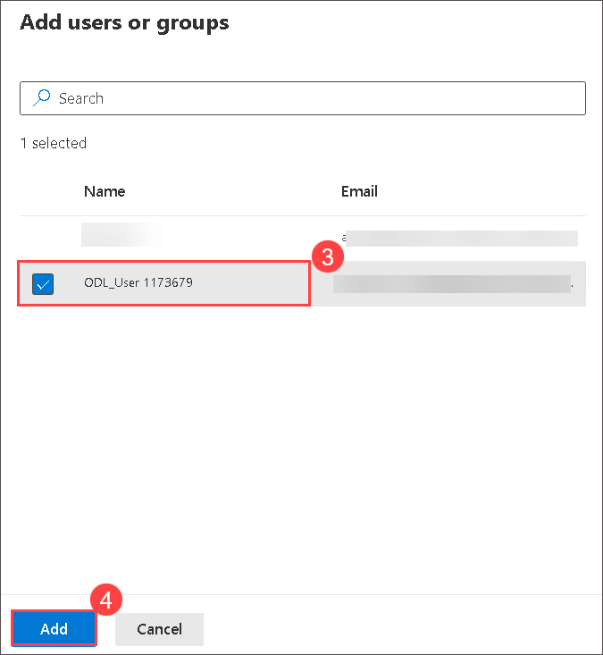

1. Then back to Assign permission page, Click on **Save**.

    

   >**Note**: only selected user  can interact with content that has this label applied.  Under users and groups, the tenant is defined so all users in your tenant can 
   view content that has this label.

1. Click  **Next** on **Encryption** window.

   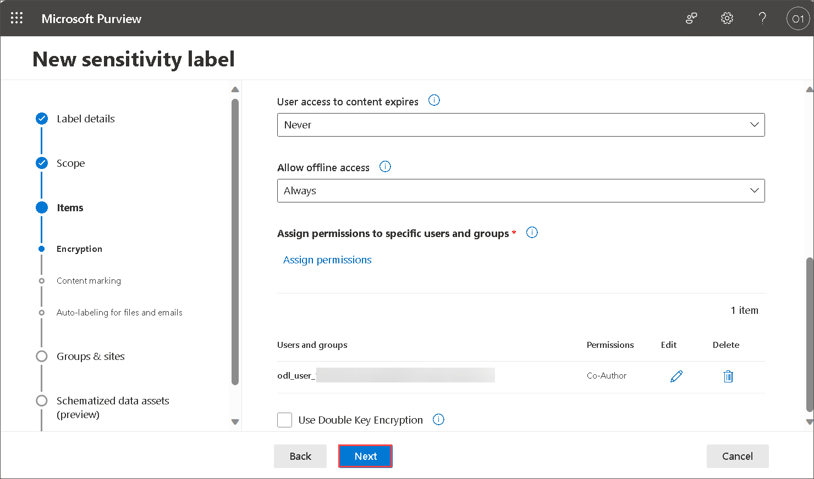
   
1. On the content markings page, take note of the information box on the top of the page. Turn on the **Content Making** and select check box for **Add a watermark**, **Add a header** and **Add a footer**.

    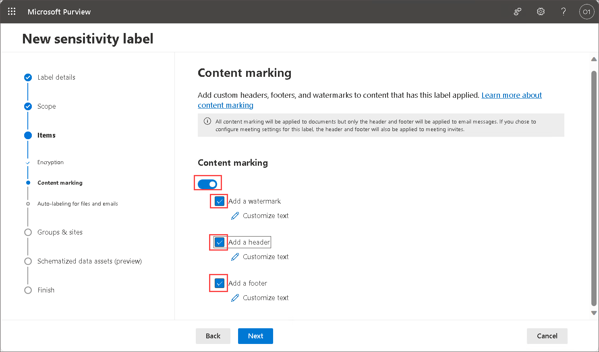
   
1. Select **Add a watermark**, click on **Customize text** on each and provide the **Confidential Document** text to it and click on **Save**.

    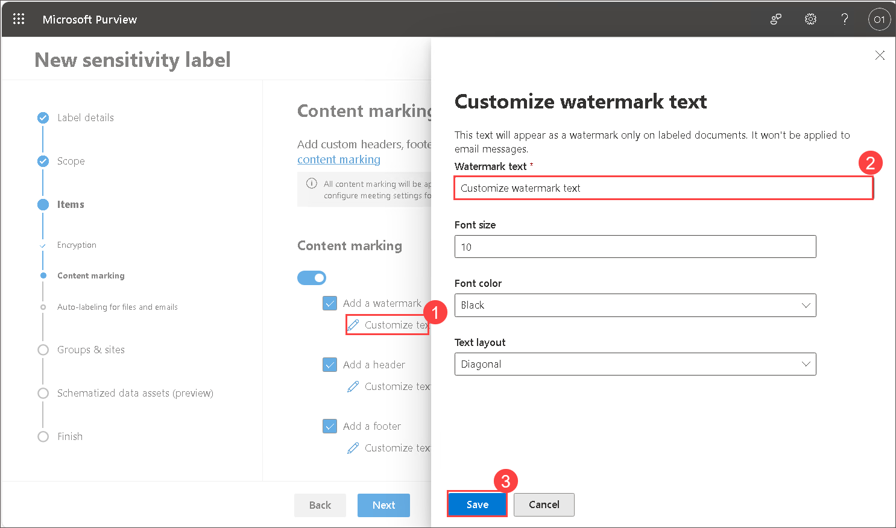
  
1. Repeat last step for **Add a header**, & **Add a footer**, and click on **Customize text** on each and provide the **Confidential Document** text to it and click on **Save**.  Content markings will be applied to documents but only headers and footers will be applied to email messages. In other words, watermarks are not applied to emails.

1. The content marking associated with this label is a watermark. Select **Next** on the bottom of the page.

    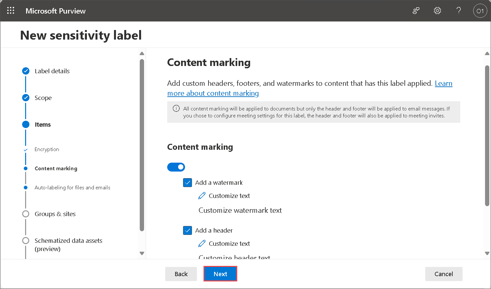
      
1. You are now in the Auto-labeling for files and emails window. Turn on the **Auto-labeling for files and emails** and Read the description of auto-labeling on the top of the page and the information box below it. Select **Next** on the bottom of the page.

      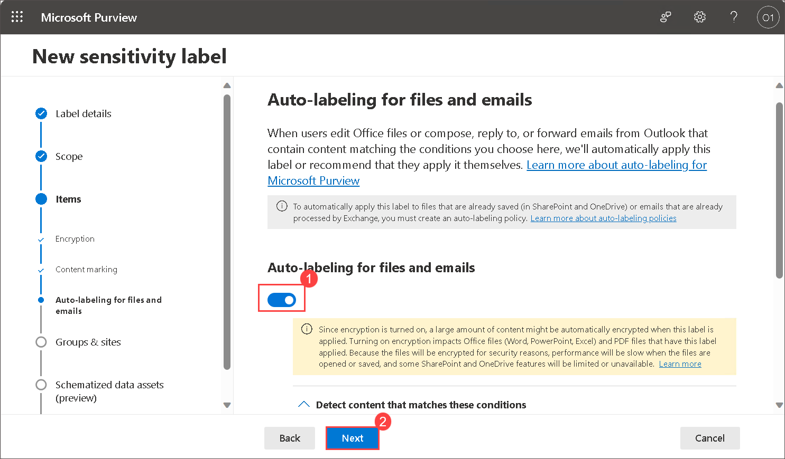

1. This next window defines protection settings for groups, and sites that have this label applied. This is not enabled, select **Next** on the bottom of the page.

      

1. This next window is a preview feature to automatically apply this label to Azure database columns (such as SQL, Synapse, and more) that contain the sensitive info types you choose.  This features is not enabled. Select **Next** on the bottom of the page.

     
          
1. Review the settings and click on **Create label**.

   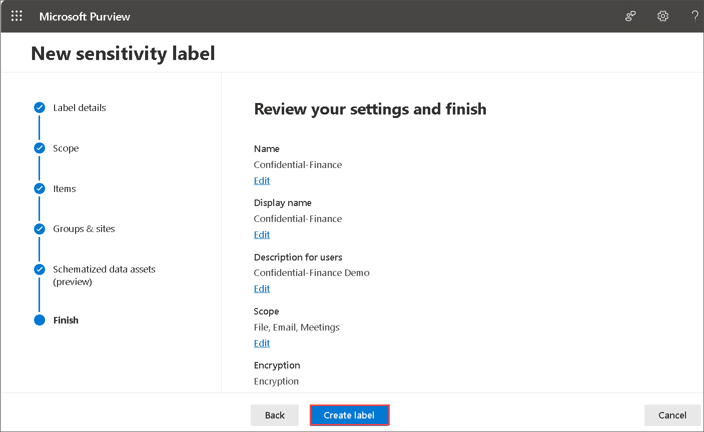
      
1. On Your sensitivity label was created blade, select **Don't create a policy yet** and click on **Done**.

   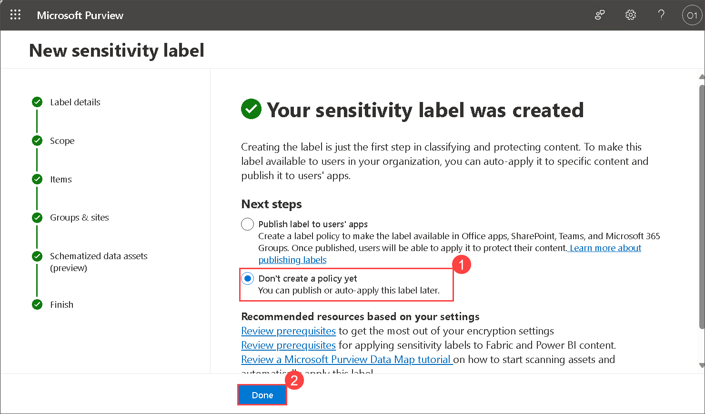

1. Back on **labels** blade notice newly created sensitivity labels.

   

Once you have created sensitivity labels and in next lab you'll configured label policies and then you can start using them and learn how to manage sensitivity labels. You'll also learn to apply sensitivity labels to emails and files in up coming labs.

      
## Review
In this lab, you have completed:
+ Explored and configure Sensitive Labels

## You have successfully completed the lab
