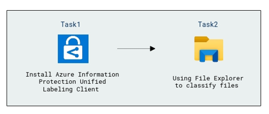
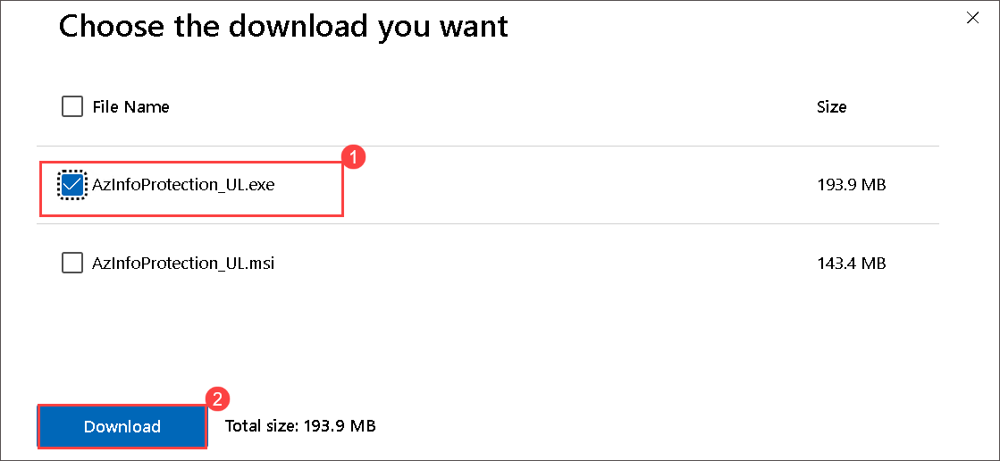

# Lab 04 - Install and Use Azure Information Protection Unified Labeling Client To Classify Files

## Lab Overview

This lab focuses on installing and utilizing the Azure Information Protection (AIP) Unified Labeling Client for Windows. The AIP client helps safeguard sensitive documents and emails by applying classification labels and Rights Management protection technology. 

## Lab scenario
In this lab, you'll install and use the Azure Information Protection unified labeling client for Windows to label and classify and protect the single or multiple file and folders. The lab aims to provide hands-on experience in deploying the AIP Unified Labeling Client and classifying files using File Explorer.

## Lab objectives

In this lab, you will complete the following tasks:

+ Task 1: Install Azure Information Protection Unified Labeling Client
+ Task 2: Using File Explorer to classify files 

## Architecture diagram

>**Note**: Edge is not needed for DLP policy to apply to Edge. "The Microsoft Purview Extension is able to provide existing Endpoint DLP capabilities to non-native applications." Edge is native.

### Task 1: Install Azure Information Protection Unified Labeling Client 

1. Open **Microsoft edge** from the Lab VM desktop by double-clicking on it. 

1. Browse for [Microsoft Download Center](https://www.microsoft.com/en-us/download/details.aspx?id=53018) to Download AzInfoProtection_UL.exe.

1. On Azure Information Protection page click on **Download**.

   

1. On Choose the download you want page, select **AZInfoProtection_UL.exe** and click on **Download**.

   

3. Run the executable file that was downloaded, and if you are prompted to continue, click Yes.

4. On the Install the Azure Information Protection client page, click I agree when you have read the license terms and conditions.

   

6. If you are prompted to continue, click Yes, and wait for the installation to finish.

7. Click Close.

   

### Task 2: Using File Explorer to classify files 

In this task, you'll classify file by using File Explorer

1. In File Explorer, create one folder  and right-click, and select show more option.

1. Select Classify and protect.

1. In the Classify and protect - Azure Information Protection dialog box, use the labels as you would do in an Office application, which sets the classification as defined by your administrator.
  
1. You can select any label, in which file is label and click Apply and wait for the Work finished message to see the results. Then click Close.

   

1. If you change your mind about the label you chose, simply repeat this process and choose a different label.

1. The classification that you specified stays with the file, even if you email the file or save it to another location.

   >**Note**: Implementing Azure Information Protection is crucial for organizations to enhance data security and control access to sensitive information. The Unified 
    Labeling Client enables users to classify and protect files, ensuring that confidential data remains secure, even if documents are forwarded or saved in different 
    locations. This lab equips users with the skills to deploy the AIP client and apply classification labels to files.

### Conclusion
By completing the tasks outlined in this lab, users gain practical knowledge of deploying the Azure Information Protection Unified Labeling Client and utilizing it to classify files. This knowledge is essential for organizations seeking to enhance their data protection strategies and ensure compliance with security and privacy requirements. The lab emphasizes the importance of incorporating AIP tools into the data management workflow.

### Review
In this lab, you have completed:
+ Install Azure Information Protection Unified Labeling Client
+ Using File Explorer to classify files 

## You have successfully completed the lab
