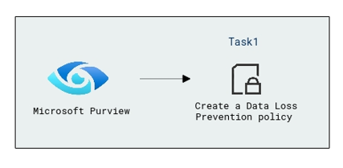
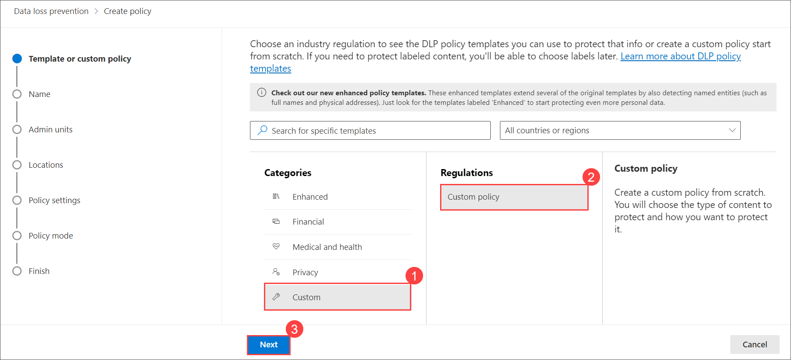
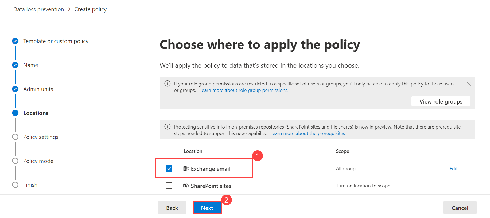
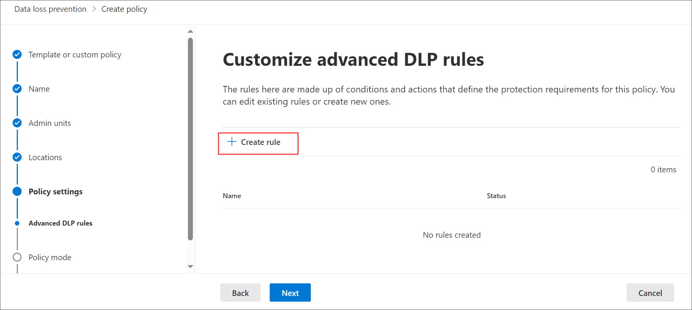
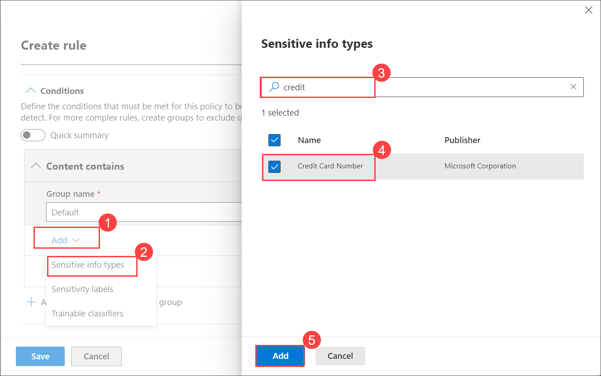
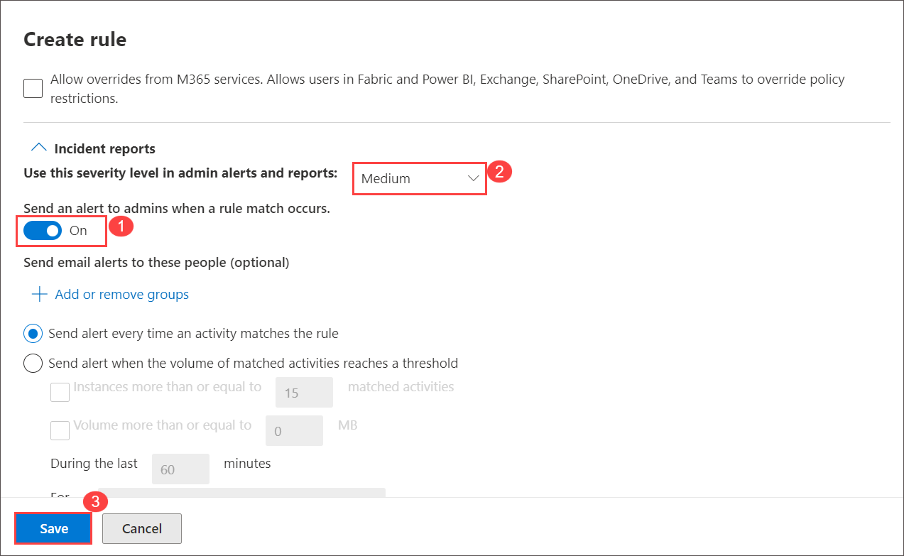
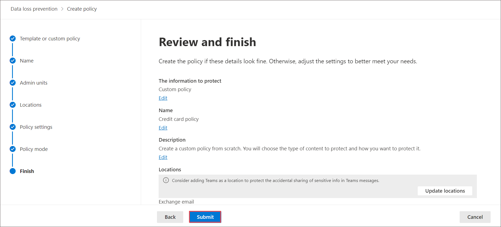

# Lab 06 - Create a Data Loss Prevention (DLP) policy

## Lab Overview

This lab is designed to guide users through the process of creating a Data Loss Prevention (DLP) policy in the Microsoft Purview portal. The DLP policy aims to protect sensitive data, specifically Credit Card information, from being shared by users. The policy is configured to notify users when attempting to share such information, This lab provides hands-on experience in setting up a customized DLP policy tailored to the organization's data protection needs.

## Lab scenario

In this lab, you will create a Data Loss Prevention policy in the Microsoft Purview portal to protect sensitive data from being shared by users.

In Microsoft Purview, you implement data loss prevention by defining and applying DLP policies. With a DLP policy, you can identify, monitor, and automatically protect sensitive items across:

- Microsoft 365 services such as Teams, Exchange, SharePoint, and OneDrive
- Office applications such as Word, Excel, and PowerPoint
- Windows 10, Windows 11, and macOS (Catalina 10.15 and higher) endpoints
- Non-Microsoft cloud apps
- On-premises file shares and on-premises SharePoint

## Lab objectives

In this lab, you will complete the following tasks:
+ Task 1: Create a Data Loss Prevention (DLP) policy
+ Task 2: Demonstrating Data Loss Prevention DLP Policy

## Architecture diagram

### Task 1: Create a Data Loss Prevention (DLP) policy

In this task, you will create a Data Loss Prevention policy in the Microsoft Purview portal to protect sensitive data from being shared by users.

1. In **Microsoft Edge**, navigate to **https://compliance.microsoft.com** 

1. In the **Microsoft Purview** portal, in the left navigation pane, expand **Data loss prevention** and select **Policies**.

   

1. On **Policies** page, select **+ Create policy** to start the wizard for creating a new data loss prevention policy.

    

1. On the **Start with a template or create a custom policy** page, scroll down and select **Custom** under **Categories** and **Custom policy** under **Regulations**. By default, both  options should already be selected , select **Next**.

   
   
1. On the **Name your DLP policy** page, type **Credit Card Policy** in the **Name** field and **Protect credit card numbers from being shared** in the **Description** field. Select **Next**.

   

1. On Assign admin units page, click **Next**.

   

1. On the **Choose where to apply the policy** page, select only **Exchange email** and uncheck other option and click **Next**. 

     
   
1. On the **Define policy settings** page, select **Create or customize advanced DLP rules** and select **Next**.

   

1. On the **Customize advanced DLP rules** page, select **+ Create rule**.

    

1. On the **Create rule** page, type **Credit card information** in the **Name** field.

1. Under **Conditions**, select **+ Add Condition** and then select **Content contains** from the dropdown menu.

   

1. In the new **Content contains** area, select **Add** and select **Sensitive info types** from the dropdown menu. On the **Sensitive info types** page, select **Credit Card Number** and select **Add**.

   

1. Under **Action** click **Add an actions** and select **Restrict access or encrypt the content in Microsoft 365 locations** fron the dropdowm menu.

    

1. Under **Restrict access or encrypt the content in Microsoft 365 locations** select **Block everyone**.

    

1. Unser **User notifications** select toggle for **Use notifications to inform your user and help educate them on the proper use of sensitive info** and enable check box for **Show the policy tip as a dialog for the end user before send**.

   

1. Under **Incident reports** select **severity level** as **Medium** click on  the toggle for **Under send an alert to admins when a rule match occurs** and click on **Save**.

    

1. Back on **Customize advanced DLP rules** page, and click on **Next**.

    

1. On **Policy mode** select **Turn the policy on immediately** and click **Next**.
  
1. On the Review and finish review the information and click **submit**. 

     

   >**Note**: You have now created a DLP policy that scans for Credit Card numbers in Microsoft outlook.

   >**Note**: Data Loss Prevention policies are critical for organizations to prevent inadvertent sharing of sensitive information. In this scenario, the focus is on protecting Credit Card numbers. The lab ensures that users are informed and prompted to before sharing such data. This proactive approach helps in securing sensitive information and ensures that users are aware of the policy requirements.

### Task 2 : Demonstrating Data Loss Prevention DLP Policy

In this task you'll Compose an email containing sensitive information that matches the conditions specified in the DLP policy. For example, include credit card numbers in the email body.

1. From the Microsoft Purview home page, select the **app launcher icon**, and **right click on the Outlook icon** and select **Open in new tab**.

      

1. Select **New Email** from the top left corner of the screen.

1. Enter an email address to which you have access and is not part of the this domain and provide subject, enter some demo credit card number and try to send this 
   mail.

   >**Note**: observe if a policy tip appears as a dialog for the end user before sending. This will inform the user about the sensitive content in the email and educate them on proper usage.

      

1. Observe that email is restricted by the policy, and you'll receive a message as demonstrated below.
    
       

   >**Note**: Alerts can be sent every time an activity matches a rule, which can be noisy or they can be aggregated based on number of matches or volume of items over a set period of time
   
   >**Note**: Ensure that the DLP policy is configured to block everyone for the specified actions. When the sensitive content triggers the DLP rule, the email should be blocked from being sent.

### Conclusion

Creating a Data Loss Prevention (DLP) policy is a fundamental step in safeguarding sensitive data from unintentional sharing within an organization. In this task, a DLP policy named "Credit Card Policy" was established using the Microsoft Purview portal to specifically protect credit card numbers from being shared via Microsoft Outlook.

## Review
In this lab, you have completed:
+ Create a Data Loss Prevention (DLP) policy
+ Demonstrating Data Loss Prevention DLP Policy

## You have successfully completed the lab
