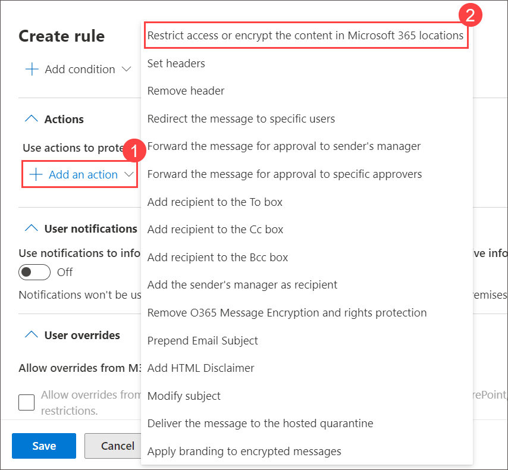
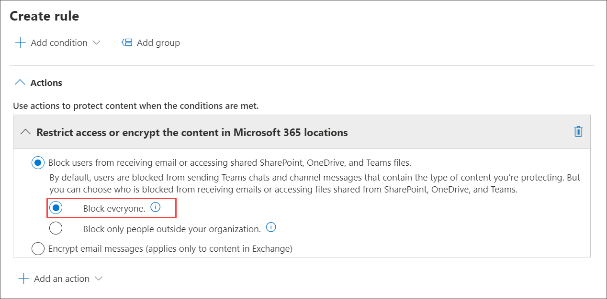
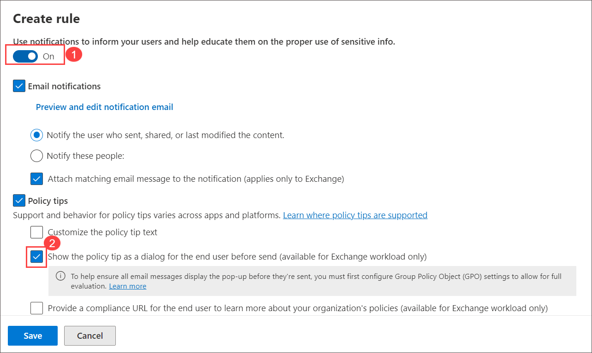

# Lab 06 - Create a DLP policy

## Lab scenario

In this lab, you will create a Data Loss Prevention policy in the Microsoft Purview portal to protect sensitive data from being shared by users. The DLP Policy that you create will inform your users if they want to share content that contains Credit Card information and allow them to provide a justification for sending this information.

## Lab objectives

In this lab, you will complete the following tasks:
+ Task 1 – Create a DLP policy

### Task 1 – Create a DLP policy

In this task, you will create a Data Loss Prevention policy in the Microsoft Purview portal to protect sensitive data from being shared by users.

1. In **Microsoft Edge**, navigate to **https://compliance.microsoft.com** 

1. In the **Microsoft Purview** portal, in the left navigation pane, expand **Data loss prevention** and select **Policies**.

   

1. On **Policies** page, select **+ Create policy** to start the wizard for creating a new data loss prevention policy.

    

1. On the **Start with a template or create a custom policy** page, scroll down and select **Custom** under **Categories** and **Custom policy** under **Regulations**. By default, both  options should already be selected , select **Next**.

   
   
1. On the **Name your DLP policy** page, type **Credit Card Policy** in the **Name** field and **Protect credit card numbers from being shared** in the **Description** field. Select **Next**.

   

1. On Assign admin units page, click **Next**.

   

1. On the **Choose where to apply the policy** page, select only **Exchange email** and uncheck other option and click **Next**. 

     
   
1. On the **Define policy settings** page, select **Create or customize advanced DLP rules** and select **Next**.

   

1. On the **Customize advanced DLP rules** page, select **+ Create rule**.
   

1. On the **Create rule** page, type **Credit card information** in the **Name** field.

1. Under **Conditions**, select **+ Add Condition** and then select **Content contains** from the dropdown menu.
   

1. In the new **Content contains** area, select **Add** and select **Sensitive info types** from the dropdown menu. On the **Sensitive info types** page, select **Credit Card Number** and select **Add**.

   

1. Under **Action** click **Add an actions** and select **Restrict access or encrypt the content in Microsoft 365 locations** fron the dropdowm menu.

   

1. Under **Restrict access or encrypt the content in Microsoft 365 locations** select **Block everyone**.
   

1. Unser **User notifications** select toggle for **Use notifications to inform your user and help educate them on the proper use of sensitive info** and enable check box for **Show the policy tip as a dialog for the end user before send**.

   

1. Under **Incident reports** select **severity level** as **Medium** click on  the toggle for **Under send an alert to admins when a rule match occurs** and click on **Save**.

   

1. Back on **Customize advanced DLP rules** page, and click on **Next**.

    

1. On **Policy mode** select **Turn the policy on immediately** and click **Next**.
  
1. On the Review and finish review the information and click **submit**. 
     

You have now created a DLP policy that scans for Credit Card numbers in Microsoft outlook and allows users to provide a business justification to override the policy.
