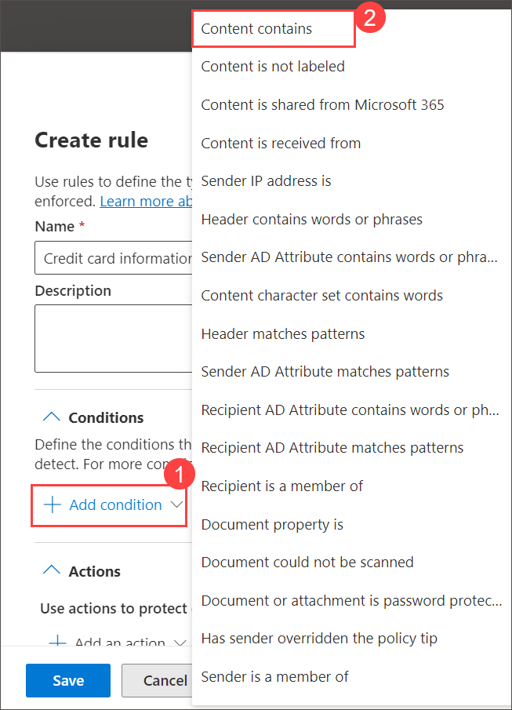
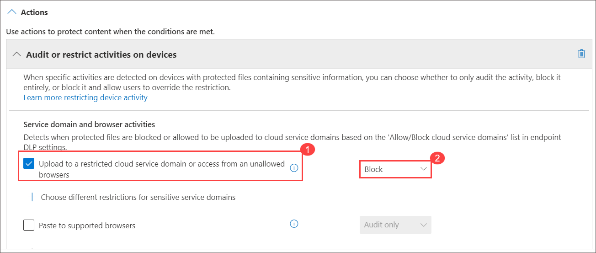
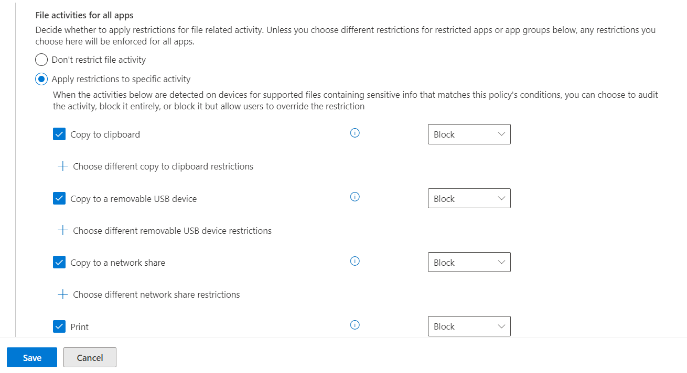

### Task 1 – Create a DLP policy in test mode

In this exercise, you will create a Data Loss Prevention policy in the Microsoft Purview portal to protect sensitive data from being shared by users. The DLP Policy that you create will inform your users if they want to share content that contains Credit Card information and allow them to provide a justification for sending this information. The policy will be implemented in test mode because you do not want the block action to affect your users yet.

1. In **Microsoft Edge**, navigate to **https://compliance.microsoft.com** 

3. In the **Microsoft Purview** portal, in the left navigation pane, expand **Data loss prevention** and select **Policies**.

   

1. On **Policies** page, select **+ Create policy** to start the wizard for creating a new data loss prevention policy.

    

1. On the **Start with a template or create a custom policy** page, scroll down and select **Custom** under **Categories** and **Custom policy** under **Regulations**. By default, both  options should already be selected , select **Next**.

   
   
1. On the **Name your DLP policy** page, type **Endpoint-dlp-policy** in the **Name** field and select **Next**.

   

1. On Assign admin units page, click **Next**.

   

1. On the **Choose where to apply the policy** page, select only **Devices** and uncheck other option and click **Next**. 

     
   
1. On the **Define policy settings** page, select **Create or customize advanced DLP rules** and select **Next**.

   

1. On the **Customize advanced DLP rules** page, select **+ Create rule**.
   

1. On the **Create rule** page, type **Endpoint-rule** in the **Name** field.

1. Under **Conditions**, select **+ Add Condition** and then select **Content contains** from the dropdown menu.
   

1. In the new **Content contains** area, select **+ Add** and select **Sensitive info types** from the dropdown menu. On the **Sensitive info types** page, select **Credit Card Number** and select **Add**.

   

1. In the new **Content contains** area, select **+ Add** and select **Sensitive labels** from the dropdown menu. On the **Sensitive label** page, select **Confidential_Finance** and select **Add**.

1. Under **Action** click **Add an actions** and select **Audit or restrict activities on devices** fron the dropdowm menu.

1. Under **Service Domain and Browser Activities**, select checkbox for **upload to a restricted Cloud Service domain or access from an unallowed browser** and from the dropdown select **Block**.

   

1. For **Files activities for all apps**, select **Apply restriction to specific activities**  and choose all the activities and from the drop down select **Block** for all. 

   

1.  under Incident report, select the severity to medium and turn on the toggle for **Send an alert to admin when rule matches occur** and select **Send alert every time an alert on an activity matches the rule** and click on save.

   

1. Back on **Customize advanced DLP rules** page, and click on **Next**.

1. On **Policy mode** select **Run the policy in test mode** and click **Next**.
  

1. On the Review and finish review the information and click **submit**. 
    
