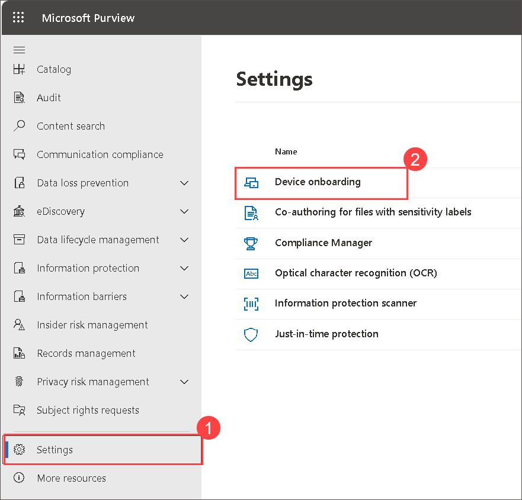
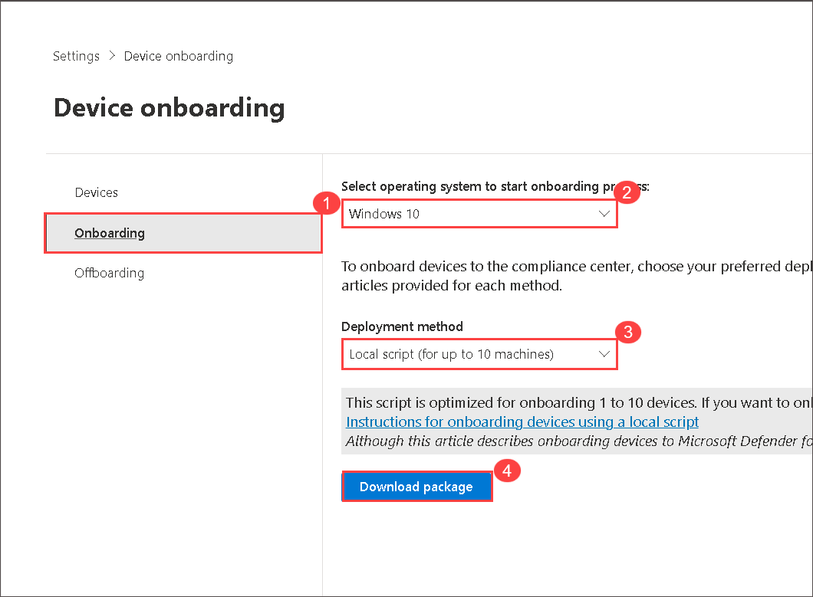
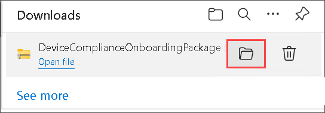
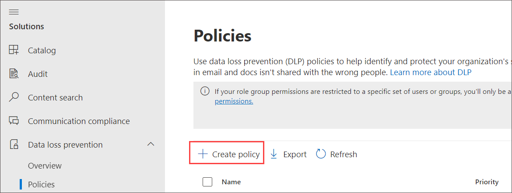
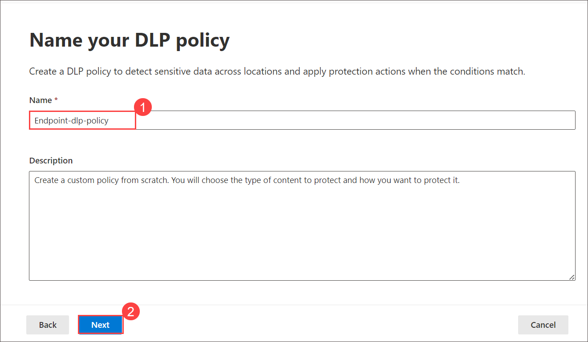
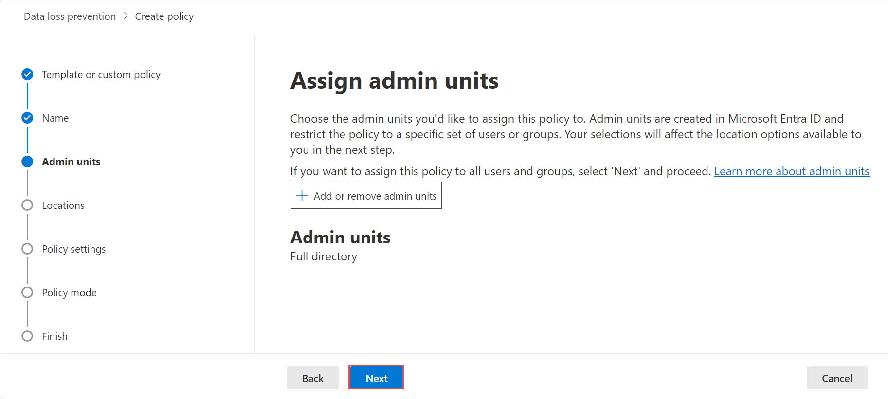
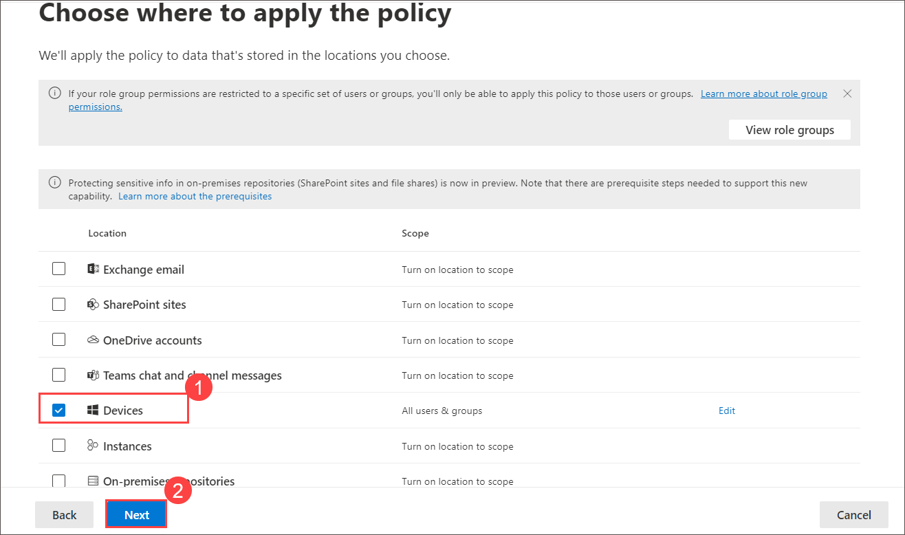
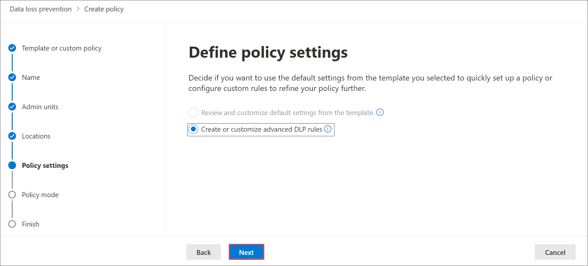
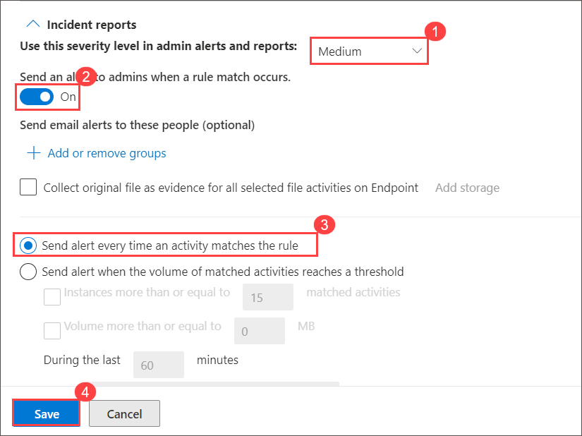
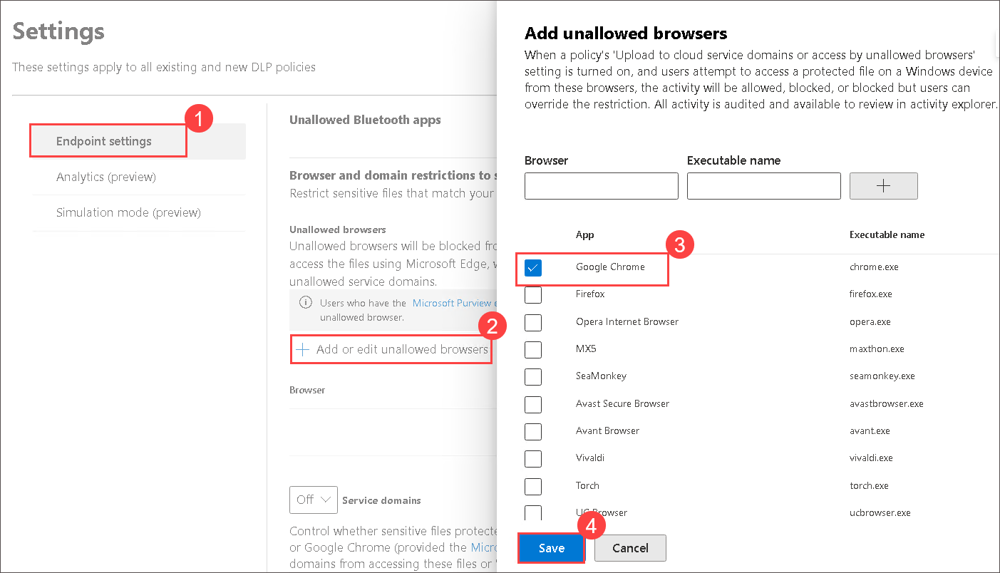

# Lab  07 - Implementing Microsoft Purview extension for Chrome

## Lab scenario

In this lab you'll be implementing the the Microsoft Purview extension for Google Chrome in a controlled lab environment.
To enhance data discovery and classification capabilities.

## Lab objectives

In this lab, you will complete the following tasks:
+ Task 1 – Prerequisties
+ Task 2 : Create a policy
+ Task 3 : Updating Endpoint settings
+ Task 4 : Test the Extension

## Architecture diagram


### Task 1 – Prerequisties

### Configure the proxy server manually using "netsh" command

>**Note**: If you're onboarding Windows 10 or Windows 11 devices, we need to make sure that the device can communicate with the cloud DLP service.

1. From Start menu type cmd right-click **Command prompt** and select **Run as administrator**.

1. Enter the following command and press Enter:
    ```
    netsh winhttp set proxy 10.0.0.6:8080
    ```

   >**Note**: This will affect all applications including Windows services which use WinHTTP with default proxy.

### Join device to Microsoft Entra

1. Select the Start menu and type, then choose **Settings** from the search results.
   
1. From the left menu select **Account** > **Access work or school** and click on **Connect** button.
   
1. On Sign in page select join to **Microsoft Entra ID** and sign in with following crendential

   * Email/Username: <inject key="AzureAdUserEmail"></inject>
   
   * Password: <inject key="AzureAdUserPassword"></inject>
  
### Onboard Windows 11 devices into Microsoft 365

1. Open Microsoft Edge and go to  **Microsoft Purview compliance**(https://compliance.microsoft.com/) portal.

1. Choose Settings > Device onboarding. 

    

1. Select **Device** on **Device Onboarding**, window and choose **Turn on device onboarding**.

   >**Note**: Wait for a few minutes for the device to turn on, and refresh the page every now and then.

1. Select "Onboarding" to start the onboarding process and follow the steps below:

   - Select operating system to start onboarding process: **Window 10**
   - Deployment method: **Local script (for up to 10 machines)**
   - Click **Download package**

    

1. Once downloading is completed click on **show on folder** icon.

   

1. On File Explorer, right click on the **DeviceComplianceOnboardingPackage** file and select extract all.

1. On Extract Compressed zip folder, window with default loaction click on Extract.   

   >**Note**: You must enable device monitoring and onboard your endpoints before you can monitor and protect sensitive items on a device. Both of these actions are done in the Microsoft Purview compliance portal.

1. Right-click on the extracted file "WindowsDefenderATPLocalOnboardingScript.cmd" and select **Properties**. Select the **Unblock** checkbox in the bottom right of the Properties windows and select **OK**.

1. Right-click on the extracted file **WindowsDefenderATPLocalOnboardingScript.cmd** again and choose **Run as Administrator**.

1. Enter **Y** to the question presented by the script and press **Enter**. When complete you should see a message in the command screen that says **Successfully onboarded machine to Microsoft Defender for Endpoint**.
   
1. Press any key to continue. This will close the Command Prompt window.

1. Back in the Onboarding page, under the section "2. Run a detection test", copy the detection test script by selecting the **Copy** button.

1. In the windows search bar of the virtual machine, type **CMD** and choose **Run as Administrator** on the right pane for the Command Prompt app. 

1. Paste the script by right-clicking in the **Administrator: Command Prompt** windows and press **Enter** to run it.

   **Note:** The window closes automatically after running the script.

   >**Note:** If you have completed the onboarding process and don't see devices in the Devices list after an hour, it might indicate an onboarding or connectivity problem.

1. In the purview portal, in the left-hand menu, select **Devices** and if the device isn't displayed, please wait for a while.

    >**Note:** If you have completed the onboarding process and don't see devices in the Devices list after an hour, it might indicate an onboarding or connectivity problem.

### Install the extension for Chrome on your Windows devices

1. Open Microsoft Edge and go to  Microsoft Purview Extension(https://chromewebstore.google.com/detail/microsoft-purview-extensi/echcggldkblhodogklpincgchnpgcdco)

1. On **Switch to Chrome?** click on **Yes**, then download and install.

1. Under **The browser built to be yours** click on **Download Chrome**.

1. Open downloded Chrome.setup.exe file and Install it.     

### Task 2 : Create a policy

1. Open Microsoft Edge and go to  **https://compliance.microsoft.com** 

1. In the **Microsoft Purview** portal, in the left navigation pane, expand **Data loss prevention** and select **Policies**.

   

1.  On **Policies** page, select **+ Create policy** to start the wizard for creating a new data loss prevention policy.

    

1. On the **Start with a template or create a custom policy** page, scroll down and select **Custom** under **Categories** and **Custom policy** under **Regulations**. By default, both  options should already be selected , select **Next**.

   
   
1. On the **Name your DLP policy** page, type **Endpoint-dlp-policy** in the **Name** field and select **Next**.

   

1. On Assign admin units page, click **Next**.

   

1. On the **Choose where to apply the policy** page, select only **Devices** and uncheck other option and click **Next**. 

     
   
1. On the **Define policy settings** page, select **Create or customize advanced DLP rules** and select **Next**.

   

1. On the **Customize advanced DLP rules** page, select **+ Create rule**.

    

1. On the **Create rule** page, type **Endpoint-rule** in the **Name** field.

1. Under **Conditions**, select **+ Add Condition** and then select **Content contains** from the dropdown menu.

     

1. In the new **Content contains** area, select **+ Add** and select **Sensitive info types** from the dropdown menu. On the **Sensitive info types** page, select **Credit Card Number** and select **Add**.

     

1. In the new **Content contains** area, select **+ Add** and select **Sensitive labels** from the dropdown menu. On the **Sensitive label** page, select **Confidential_Finance** and select **Add**.

1. Under **Action** click **Add an actions** and select **Audit or restrict activities on devices** fron the dropdowm menu.

1. Under **Service Domain and Browser Activities**, select checkbox for **upload to a restricted Cloud Service domain or access from an unallowed browser** and from the dropdown select **Block**.

    

1. For **Files activities for all apps**, select **Apply restriction to specific activities**  and choose all the activities and from the drop down select **Block** for all. 

    

1.  under Incident report, select the severity to medium and turn on the toggle for **Send an alert to admin when rule matches occur** and select **Send alert every time an alert on an activity matches the rule** and click on save.

      

1. Back on **Customize advanced DLP rules** page, and click on **Next**.


1. On **Policy mode** select **Turn the policy on immediately** and click **Next**.
  

1. On the Review and finish review the information and click **submit**.


### Task 3 : Updating Endpoint settings

In this task you'll configure Browser and domain restrictions to sensitive data

1. Navigate to the Policies page and choose the Settings icon located in the top-right corner of the page.

1. From the left menu select **Endpoint settings** and expand **browser and domain restriction to sensitive data**, under Unallowed browsers click on **+ Add or Edit Unallowed browser**, and **Google Chrome** then click on Save.

     

   >**Note**  Unallowed browsers will be restricted from reaching files protected by your policies. When access is denied, users will receive a prompt to use Microsoft Edge, allowing interaction with the content but preventing uploads to unauthorized service domains.


### Task 4 : Test the Extension

1. Create one word document with mutliple demo credit numbers and name the file as protected and save it one drive.
 
1. Search and select google chrome from start menu  and copy the link of a word document containing sensitive information, and then try to paste it in Google Chrome. Observe the notification indicating a lack of permission to access the file.

1. open another tab in google chrome and browse for (https://www.virustotal.com/gui/home/upload) and upload the document that containing sensitive information notice how policy is blocked from upload protected file from unallowed browsers Cloud Egress

   

   >**Note**: By successfully implementing the Microsoft Purview extension for Google Chrome, you have enhanced data discovery capabilities, allowing for more effective management and protection of sensitive information across web pages and documents. This integration supports a proactive approach to data governance within your organization.

### Conclusion
By completing this lab, users gain practical experience in implementing the Microsoft Purview extension for Chrome. The extension enhances data discovery, classification, and protection capabilities, contributing to a comprehensive data governance strategy. The lab emphasizes the importance of configuring policies and endpoint settings to enforce security measures effectively.

## Review
In this lab, you have completed:

+ Prerequisties
+ Create a policy
+ Updating Endpoint settings
+ Test the Extension

## You have successfully completed the lab
