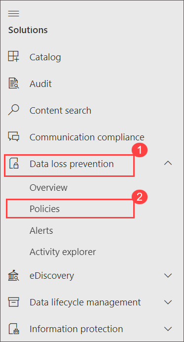

# Configure DLP Alerts

In this exercise, you will create a Data Loss Prevention policy in the Microsoft Purview portal to protect sensitive data from being shared by users. The DLP Policy that you create will inform your users if they want to share content that contains Credit Card information and allow them to provide a justification for sending this information. The policy will be implemented in test mode because you do not want the block action to affect your users yet.

1. In **Microsoft Edge**, navigate to **https://compliance.microsoft.com** 

1. In the **Microsoft Purview** portal, in the left navigation pane, expand **Data loss prevention** and select **Policies**.

   

1. Select the **Credit card policy** and click **Edit**.

1. Navigate to **Customize advanced DLP rules** page and select **Edit** icon.

1. Under **Investigate** notice the setting and here you can change Serverity on alerts as per your requirement.

1. For now keep as it is and select cancel.
   
    >**Note**: This configuration allows you to set up a policy to generate an alert every time an activity matches the policy conditions or when a certain threshold is 
    exceeded, based on the number of activities or based on the volume of exfiltrated data.

1. In the **Microsoft Purview** portal, in the left navigation pane, expand **Data loss prevention** and select **Alerts**.

   

1. From the Microsoft Purview home page, select the **app launcher icon**, and **right click on the Outlook icon** and select **Open in new tab**.

    

1. Select **New Email** from the top left corner of the screen.

1. Add email address of outside organization people and provide subject, enter some demo credit card number and try to send this mail.
   

1. Notice that email is restricted by policy and you receive mail as showed below.
    
    

