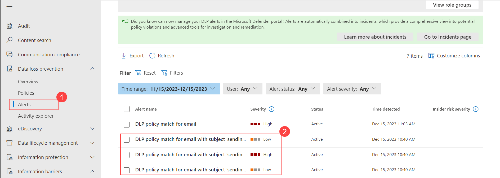
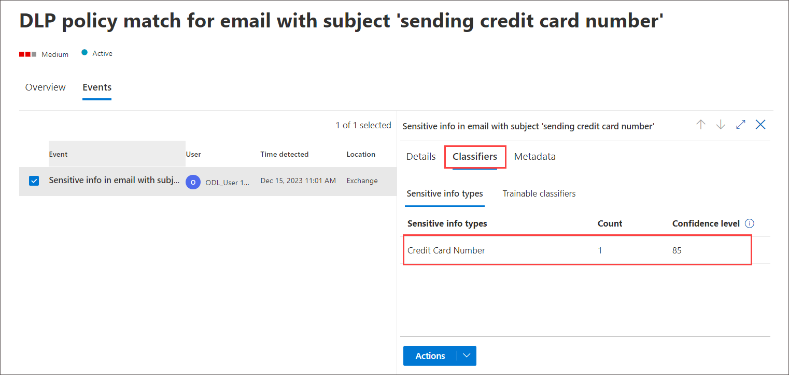
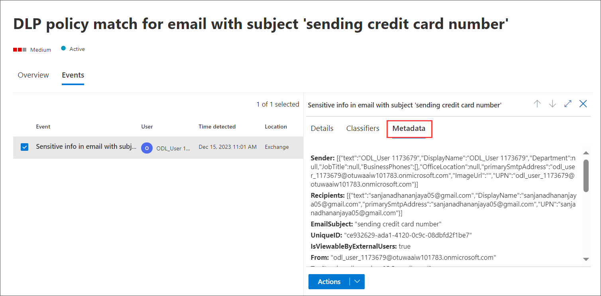
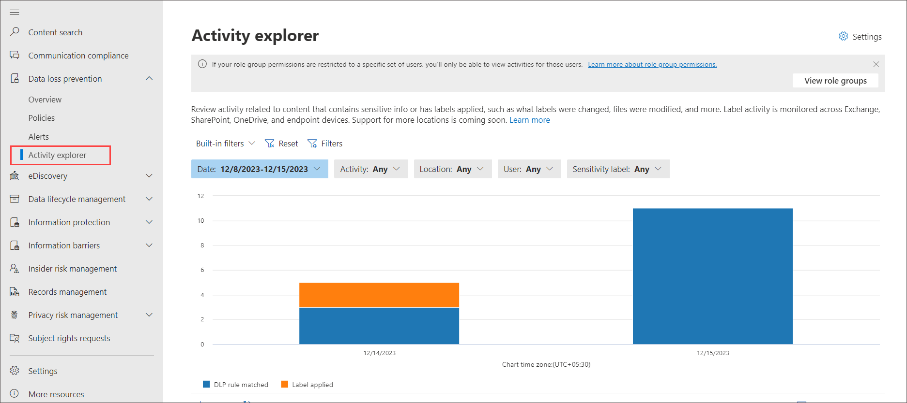

# Configure DLP Alerts

The main goal of the investigation stage is for the assigned owner to correlate evidence, determine the cause and full impact of the alert and decide on a remediation plan. The assigned owner is responsible for deeper investigation and remediation of the alert. The primary alert investigation tools are the Microsoft 365 Defender portal and the DLP alert management dashboard. You might also use Activity explorer to investigate alerts. You can also share alerts with other users in your organization.

1. In **Microsoft Edge**, navigate to **https://compliance.microsoft.com** 

1. In the **Microsoft Purview** portal, in the left navigation pane, expand **Data loss prevention** and select **Alerts** and notice alerts have been genarated you can view details for each alerts

   

1. Select any one alerts and review information and click on **View details** to verify the alerts.

     

1. Scroll down and you can see **Alert information**

   

1. Click on Event tab and review the details.
   
   

   

1. On Overview tab you can find and review all the Alerts details for user activity.

   

1. Click on Activity Explorer menu, here you can view activity of user by hover your mouse on bar chat.
   
