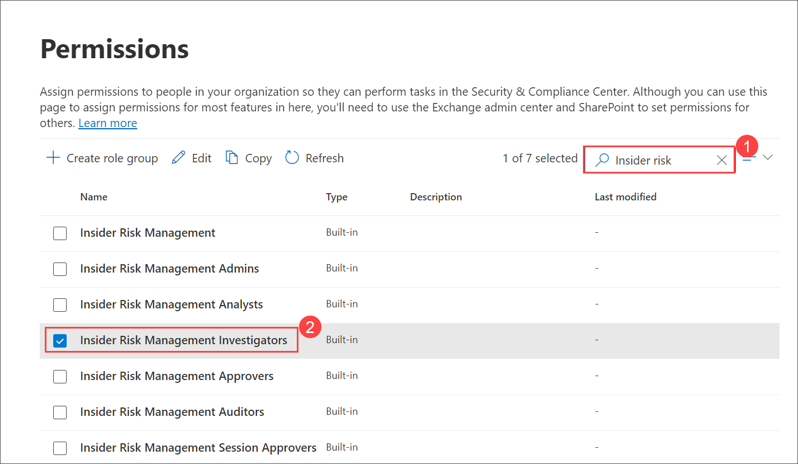
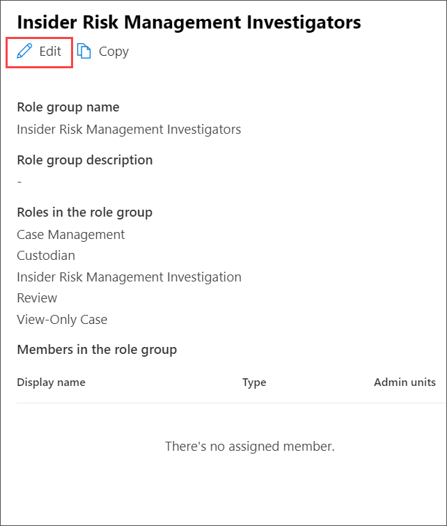
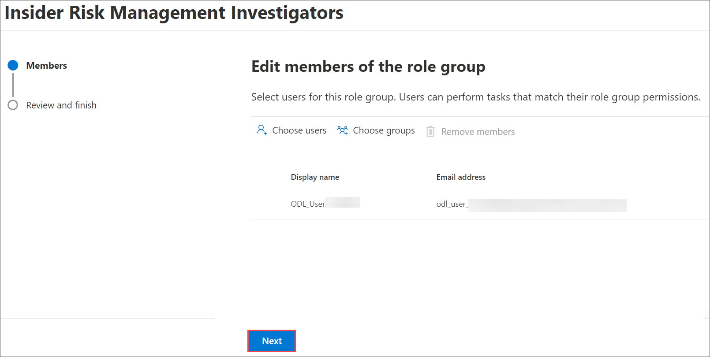
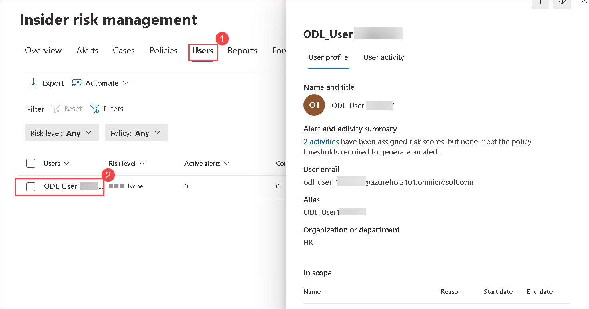
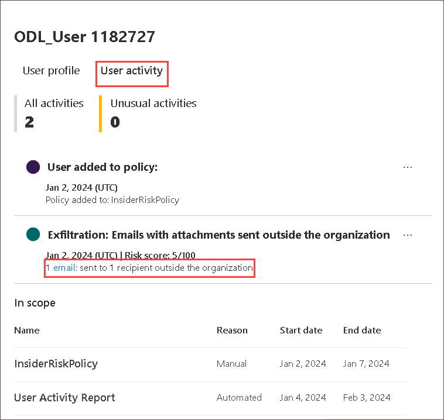
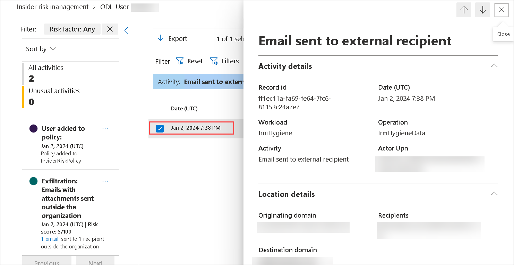

# Lab 12 - Investigate insider risk activities

## Lab Overview

Organizations employ insider risk investigation to proactively identify and respond to potential threats arising from within. Leveraging specialized tools, such as Microsoft Insider Risk Management, this process involves scrutinizing user activities, behaviors, and data access patterns. Security administrators and teams conduct detailed analyses to detect signs of IP theft, data leakage, or security violations.

## Lab scenario

In this lab, you'll setting up individuals or roles within your organization to act as investigators for insider risk incidents. Investigators play a crucial role in analyzing and responding to potential insider threats and This Investigate insider risk activities focuses on actively exploring and analyzing potential insider risk activities within the organization. 

## Lab objectives

In this lab, you will complete the following tasks:
+ Task 1 : Create Insider Risk Management Investigators
+ Task 2 : Investigate insider risk activities

## Architecture diagram

### Task 1 : Create Insider Risk Management Investigators

In this task you, as the global administrator, will enable permissions for Insider Risk Management Investigators.  Specifically, you will add users to the Insider Risk Management Investigators role group to ensure that designated users can access and manage insider risk management Investigators features.

1. If you not already login to admin center, the address bar of Microsoft edge enter **admin.microsoft.com**.

1. On **Sign in** blade, you will see a login screen, in that enter the following email/username 
 
    * Email/Username: **<inject key="AzureAdUserEmail"></inject>** and then click on **Next**.
        
1. On **Enter Password** blade, enter the following password

    * Password: **<inject key="AzureAdUserPassword"></inject>** and then click on **signin**

1. From the left navigation pane of the Microsoft 365 admin center, select **Show all**.

    

1. Under Admin centers, select **Security**.  A new browser page opens to the welcome page of the Microsoft 365 Defender portal.

    

1. From the left navigation pane of the Microsoft 365 Defender portal, select **Permissions**.  You may need to scroll down to see this option.

1. From the Permissions page, under **Email & collaboration roles** select **Roles**.

    

1. In the search bar, enter **Insider risk** then select the search icon (magnifying glass).  Notice the five roles that show up.  Each of these has different access levels.  Select **Insider Risk Management Investigators**.

    

1. In the window that opens, next to where it says Members, select **Edit**. you may need to scroll to find it.

    

1. On **Insider Risk Management Investigators** page, select choose users and select **<inject key="AzureAdUserEmail"></inject>** and then click on **select**.

    

1. Back on **Insider Risk Management Investigators** page and click on **Next**.
   
    

1. Review the role group and finish page click on **save**.
   
   
  
1. On **You successfully updated the role group** page, click on **Done**.
  
### Task 2 : Investigate insider risk activities

In this task, you'll Investigate insider risk activities

1. From the Microsoft Purview home page, select the **app launcher icon**, and **right click on the Outlook icon** and select **Open in new tab**.

      

1. Select **New Email** from the top left corner of the screen and send email to outside organisation person with document or any text.

1. Repeat the above step for at least 4 to 5 times in order to view more activities.   

1. Navigate to **Insider risk management** page, and select Overview tab the scroll down and select **Investigate user activity**, where you can view user activity.

1. From  **Insider risk management** page select **User** tab and select user to view the policy details.

      

1. Select **User Activity** tab and review the details and notice **Exfiltration** click on 1 Email link.

     

1. Review the user activity which includes Activity details, Location details and About this item.

       
    
1. From  **Insider risk management** page select **Alert** tab to Investigate user activity.
   
   >**Note**: Review the settings for your insider risk policy. The policy will take effect immediately after you create it, but may take up to 24 hours to start generating alerts. User productivity won't be impacted in any way. 

   >**Note**: Establishing Insider Risk Management Investigators ensures that designated individuals have the necessary access levels to investigate and respond to insider risk activities effectively. Investigating insider risk activities allows organizations to actively monitor user behavior, detect potential risks, and take timely actions to mitigate any threats.

### Conclusion:
By completing these tasks, the organization sets up a team of investigators with the appropriate roles, empowering them to handle insider risk incidents efficiently. Simultaneously, users can actively monitor and investigate insider risk activities, aligning with a proactive security strategy.

### Review
In this lab, you have completed:

+ Create Insider Risk Management Investigators
+ Investigate insider risk activities

## You have successfully completed the lab

