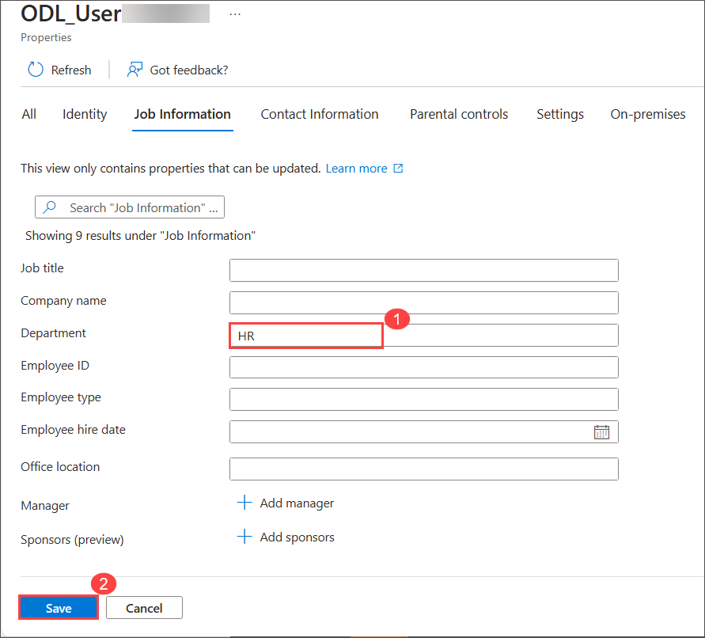
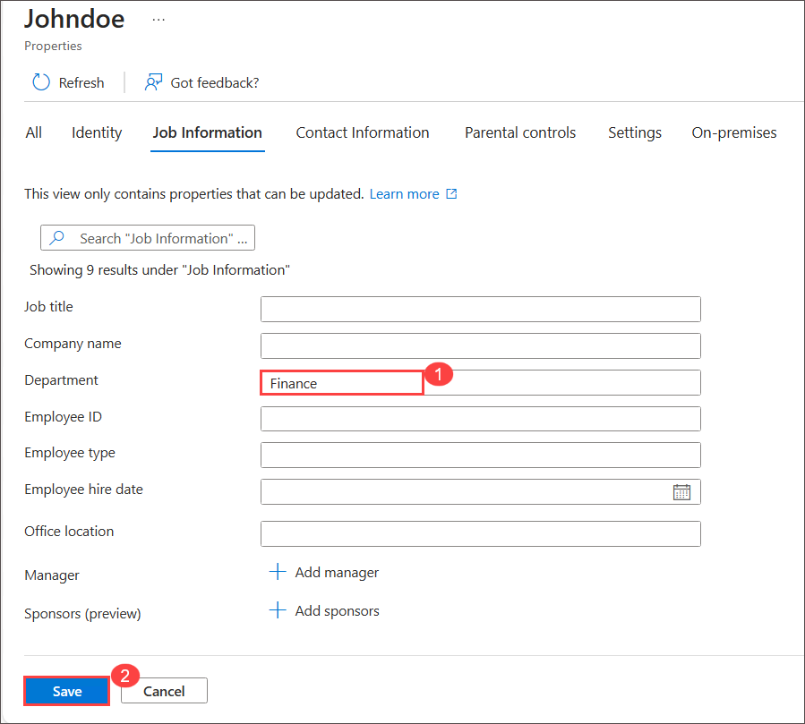
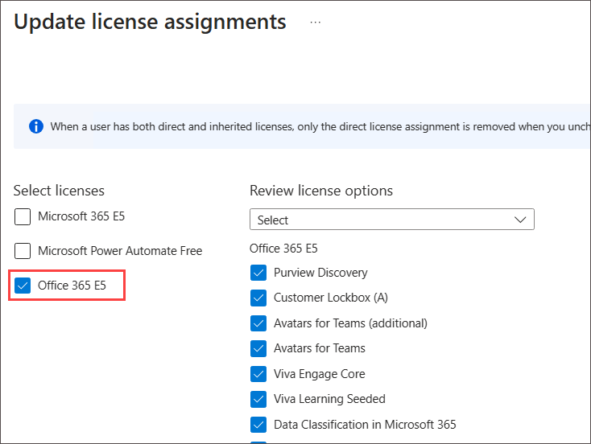
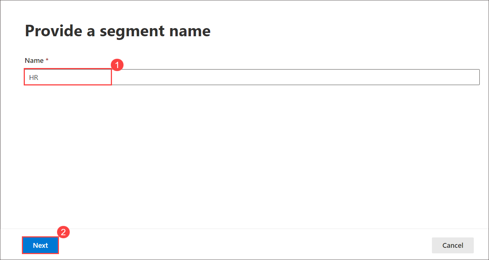
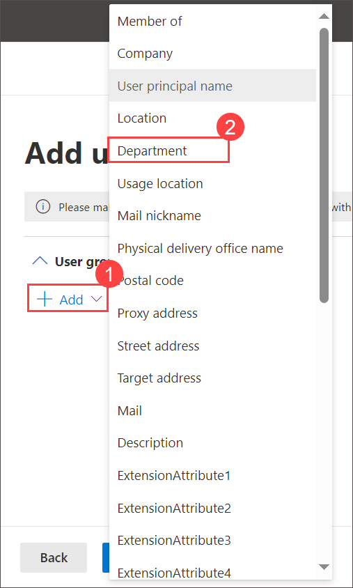
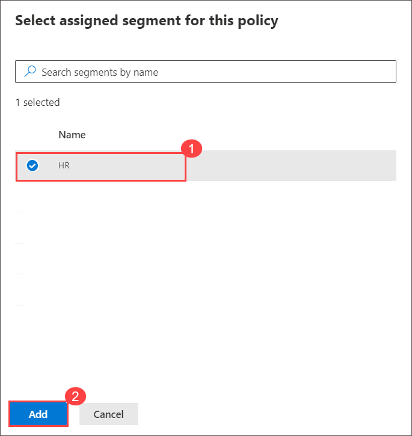
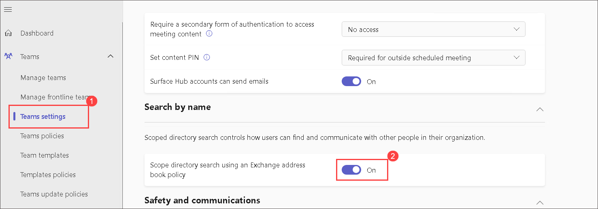

# Lab 13 - Configure Information Barriers

## Lab scenario
As Joni, the Compliance Administrator for Contoso Ltd., your responsibility is to configure and manage Information Barriers in Microsoft 365. Information Barriers play a critical role in maintaining clear boundaries and preventing unauthorized communication between specific groups or individuals within your organization. By implementing Information Barriers, you ensure compliance with regulations, protect sensitive information, and minimize conflicts of interest. This setup will create a secure work environment, safeguarding data confidentiality and supporting Contoso Ltd.'s commitment to compliance.

## Lab objectives

In this lab, you will complete the following tasks:

+ Task 1: Modifying the attribute and assigning a license for the user named *Johndoe*.
+ Task 2: Creating segments for Information Barriers
+ Task 3: Create Information barrier policies
+ Task 4: Apply Information barrier policies
+ Task 5: Assess Information Barriers functionality within Microsoft Teams.

### Task 1 : Modifying the attribute and assigning a license for the user named *Johndoe*.

In this task, you'll set the department attribute and assign a license to the user Johndoe.

1. Sign in to **Azure portal** with following credentail:
   
    * Email/Username: <inject key="AzureAdUserEmail"></inject>
   
    * Password: <inject key="AzureAdUserPassword"></inject>
  

1. On Azure Portal page, in **Search resources, services and docs (G+/)** box at the top of the portal, enter **Microsoft Entra ID**, and then select **Microsoft Entra 
   ID** under services.

1. On **Overview** page, Under **Manage** section select **User**.
   
1. Choose the <inject key="AzureAdUserEmail"></inject> user, then click on the property tab. Scroll down and navigate to Job Information, click on Edit icon

1. Under **job information** tab for  Department field, enter HR, then click Save.
    
   
1. Back on user blade, Choose the **john doe** user, then click on the property tab. Scroll down and navigate to Job Information, click on Edit icon.

1. Under **job information** tab for  Department field,  enter Finance, then click Save.

    

1. Select **john doe** user, from the left navigation, under **Manage**, select **Licenses**

1. On **john doe | Licenses** page, select the **+ Assignments** button.

1. On the Update license assignments page, select the check box for  **Office 365 E5** license.

    

1. When complete, select **Save**.

1. Now navigate to the user profile of **john doe**  from the left navigation pane select **Licenses**.

1. Notice that the license has been assigned.

   >**Note** If you're not able view assigned license kindly refresh the page.

### Task 2: Creating segments for Information Barriers

In this task, you'll create organization segments for the **HR** and **Finance** departments.

>**Note** Segmets is nothing but grouping of users

1. In **Microsoft Edge**, navigate to **https://compliance.microsoft.com**

1. Under Information Barrier, select Segment and  and click on **+ New segment**.
   

1. On **Provide a segment name** page enter **HR** in name field and click **Next**.

    

1. On **Add user group filter** page click **+ Add** from the dropdown select **Department** and under **Department** for **group operation** make sure equal selected and in Group name enter HR and click on **Next**.

    
    .png)
   
1. On Summary page, click on **Submit**.

1. Repeat last 4 step to create another segment with name **Finance**. 

## Task 3: Create Information barrier policies

In this task, you'll create Information barrier policies to block communication between the  **HR** and **Finance** departments.

1. From left navigation page of Microsoft Purview, expand Information Barrier and select Policies.

1. Click on + **Create policy**.

1. On **Provide a policy name** page, enter **Block communication from HR to Finance** and click on **Next**.

     

1. On Add assigned segment details page, select **+ Choose segment**.

1. On Select assigned segment for this policy window select **HR** and click on **Add**.

   

1. Back on **Add assigned segment details** page and click **Next**.

1. On **Configure communication and collaboration details** page
   - **Communication and collaboration** : Blocked
   - **+ Choose segment**: select Finance and click **Add**
   - Click **Next**

1. On **Configure policy status** page ture on the toggle for Set your policy to active state.

   

1. On Summary page click on **Submit** and **Done**

1. Back on **Policies** page.

1. Click on + **Create policy**.

1. On **Provide a policy name** page, enter **Block communication from Finance to HR** and click on **Next**.
   
1. On Add assigned segment details page, select **+ Choose segment**.

1. On Select assigned segment for this policy window select **Finance** and click on **Add**.
    
1. Back on **Add assigned segment details** page and click **Next**.

1. On **Configure communication and collaboration details** page
   - **Communication and collaboration** : Blocked
   - **+ Choose segment**: select HR and click **Add**
   - Click **Next**

1. On **Configure policy status** page ture on the toggle for Set your policy to active state.

   

1. On Summary page click on **Submit** and **Done**.

### Task 4 : Enable Scoped Directory Search on Microsoft Teams

In this task you'll learn how to Enable Scoped Directory Search on Microsoft Teams

1. Sign in to Office 365(https://www.office.com/) portal

1. Select **Admin** from left pane.

1. On **Microsoft 365 admin center** portal, select **Show all**.
1. Under **Admin center** section, select **Teams**.
1. On **Microsoft Teams admin center**, from left navigation pane select **Teams Settings** and scroll down under search by name  then turn on the toggle for **Scope 
   directory search using an Exchange address book policy**.

    

## Task 4: Apply Information barrier policies

In this task, you will apply the active Information barrier policies and check their application status.

1. From the left Navigation Pane, expand Information Barrier and select Policy Application.

   

1. On Policy Application page, click on Apply All Policies.

    
   
1. Once the policy is applied, the **Status** will update from **NotStarted** to **Completed**.

    

   >**Note**: Kindly **Refresh** page and Wait for the status to transition from NotStarted to Completed; this process may take 5 to 10 minutes.

### Task 5:  Assess Information Barriers functionality within Microsoft Teams.

In this task you'll 

1. From the start menu type and select **Teams** and login with following credential

   * Email/Username: <inject key="AzureAdUserEmail"></inject>
   
   * Password: <inject key="AzureAdUserPassword"></inject>

1. After Login to Microsoft teams search and try send some message to **John doe**.
1. Note that the message is failing; this is due to the Information Barrier policy we implemented, which restricts users from sending messages or documents from the HR department to the finance department.

1. Sign out as odl user and  Login as **John doe** to Microsoft teams

1. Search and attempt send a message to **ODL user** and observe that the Information Barrier policy is preventing users from sending messages from the Finance department to the HR department.

   >**Note**: Microsoft Purview Information Barriers enable you to create policies to keep people or groups from communicating with one another (when there's no business need for them to do so, or a regulatory reason to block them from doing so), and it also allows you to set policies relating to things like lookups and eDiscovery (covered below).

## Review 
In this lab, you have completed:
+ Modifying the attribute and assigning a license for the user named *Johndoe*.
+ Creating segments for Information Barriers
+ Create Information barrier policies
+ Apply Information barrier policies
+ Assess Information Barriers functionality within Microsoft Teams.
