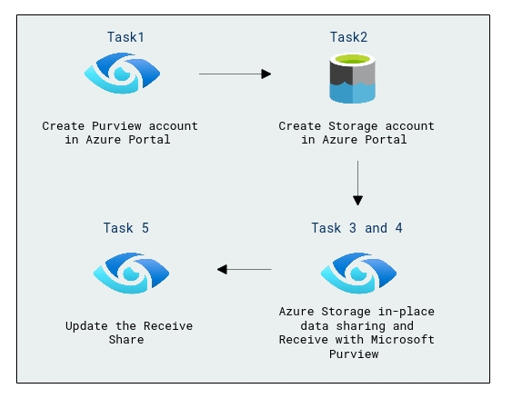
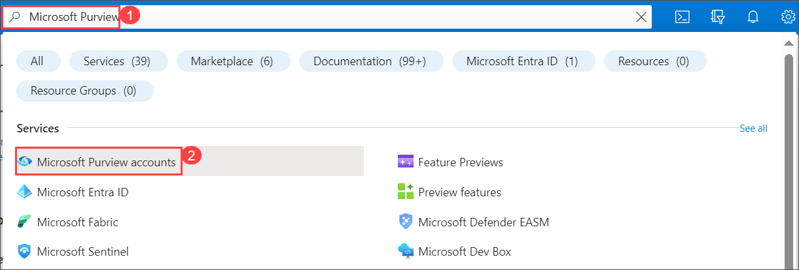
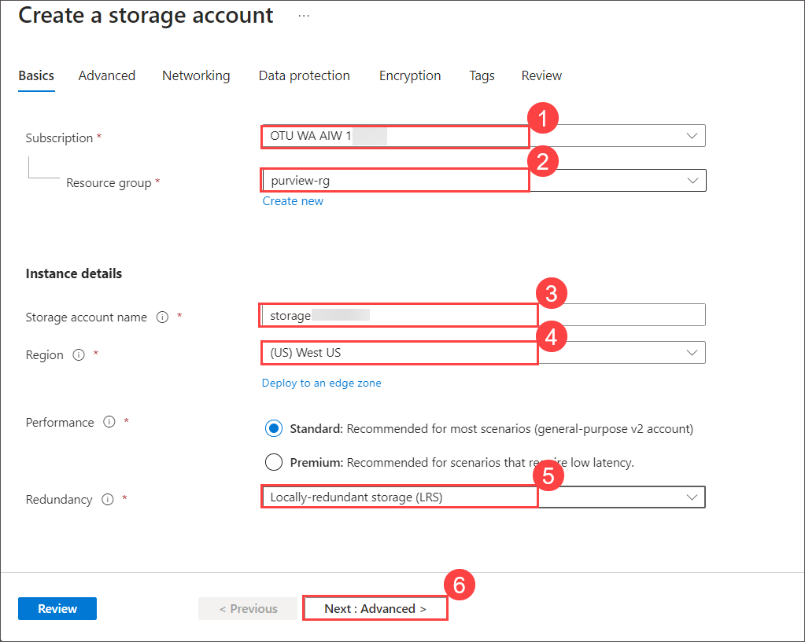
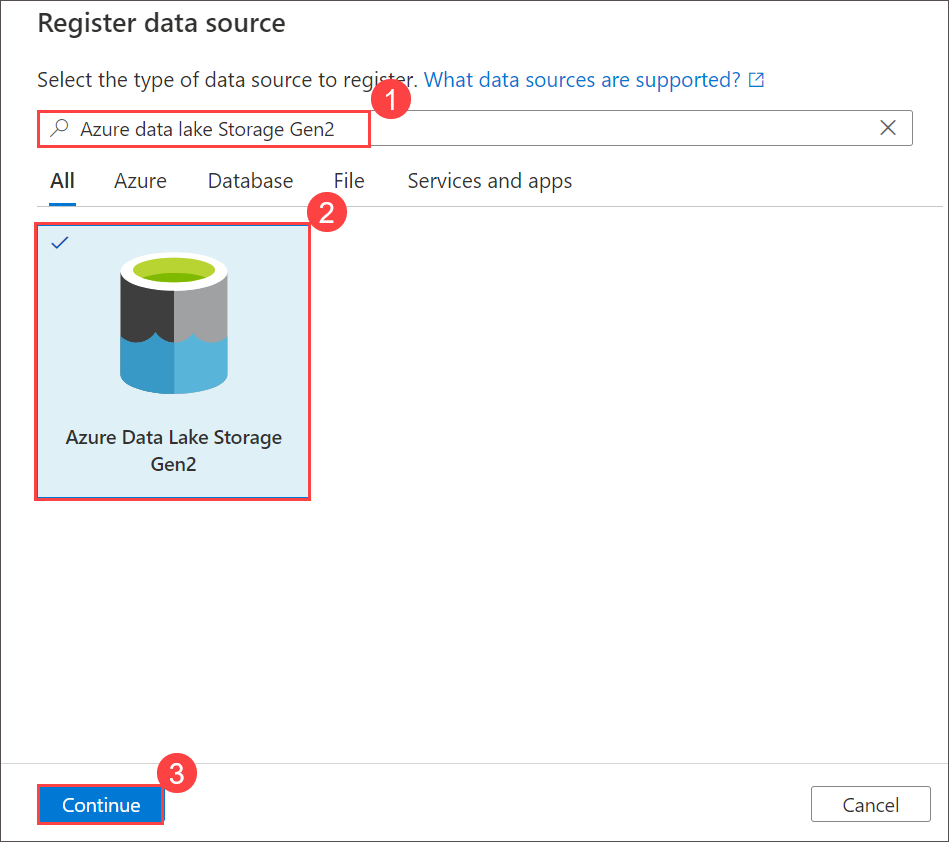
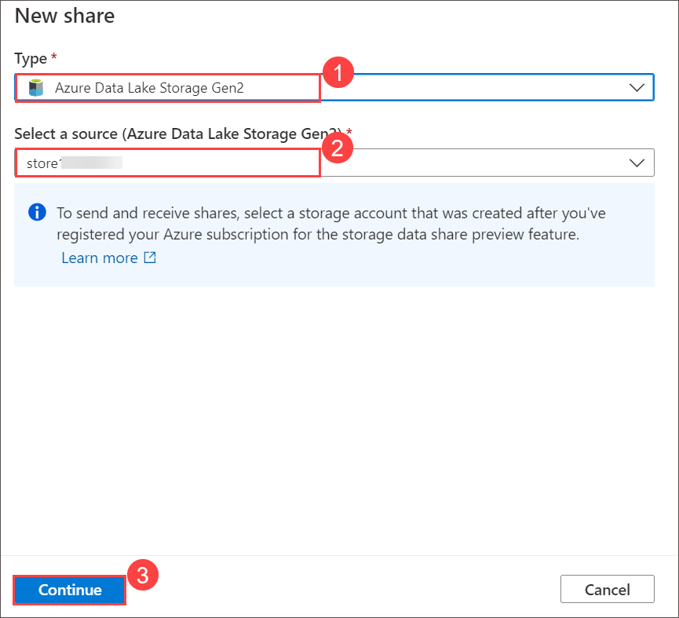

# Lab  14 - Azure Storage in-place data share with Microsoft Purview Data Sharing 

## Lab scenario

With Microsoft Purview Data Sharing, data providers can now share data in-place from Azure Data Lake Storage Gen2 and Azure Storage accounts, both within and across organizations. Share data directly with users and partners without data duplication and centrally manage your sharing activities from within Microsoft Purview.

A data provider creates a share by selecting a data source that is registered in Microsoft Purview, choosing which files and folders to share, and who to share them with. Microsoft Purview then sends an invitation to each data consumer.

## Lab objectives

In this lab, you will complete the following tasks:
+ Task 1 : Create Purview account in Azure Portal
+ Task 2 : Create Storage account in Azure Portal
+ Task 3 : Azure Storage in-place data sharing with Microsoft Purview
+ Task 4 : Azure Storage in-place data Receive share with Microsoft Purview (Read Only)
+ Task 5 : Update received share (Read Only)

## Architecture diagram

### Task 1 : Create Purview account in Azure Portal 

1. Sign in to **Azure Portal**.

1. On Azure Portal page, in **Search resources, services and docs (G+/)** box at the top of the portal, enter **Microsoft Purview**, and then select **Microsoft Purview accounts** under services.
    

1. Select **+ Create** on **Microsoft Purview accounts** page.

1. On the Basics tab specify the following details and click **Review + Create**.

    
     |   **Option**                           | **Value**                      |
     | ---------------------------------------| ------------------------------ | 
     | Subscription                           | Accept the default             |
     | Resource Group                         | Purview-rg                     | 
     | Microsoft cover your account name      | purview-account1-<inject key="DeploymentID" enableCopy="false"/>               | 
     |    location                            | **<inject key="Region" enableCopy="false"/>**                       |
     |||

    

1.  Validation is passed. Click on Create.
   
### Task 2 : Create Storage account in Azure Portal

In this task, you'll create storage account and container 

1. On Azure Portal page, in **Search resources, services and docs (G+/)** box at the top of the portal, enter **Storage accounts**, and then select  **Storage accounts** under services.

1. On the **Storage accounts** page, click on **+ Create**.

1. On the Basics tab specify the following details and click **Adavance**.

    
     |   **Option** | **Value** *        |
     | ------------ | ------------------ | 
     | Subscription | Accept the default     |
     | Resource Group  | Purview-rg     | 
     | Storage account name | storage            | 
     | Region         | **<inject key="Region" enableCopy="false"/>**   |
     | Redundancy    |     Local Redundant Storage LRS|
     |||

    

1. On Advanced tab, select **enable hierarchical namespace** and click on review.

   

1.  Once validation passed click on **Create**.

1. Once storage account is created, click on the storage account which you created.
1. Under Data Storage section, select Containers option and click on **+ container**. Provide some name and click on create.
1. Open the File Explorer and create some text file.
1. Back on **Storage account** window, select the container which you created and click on the upload, select browse for the files and select the text file which you created and click on upload.

### Task 3 : Azure Storage in-place data sharing with Microsoft Purview

In this task, you'll work on Azure Storage in-place data sharing with Microsoft Purview

1. Sign in to Purview(https://purview.microsoft.com/)

1. On **Select a Microsoft Purview account** page, leave default for Microsoft Entra ID and for **Account name** select purview    click on **continue**.
    

1. On Microsoft Purview portal from left navigation Pane,  select **Data Map** and in the Data source click on Register icon.

   

1. On **Register Data Source** window, in the search bar, search and select **Azure Data Lake Storage Gen2** and click on Continue.

     

1. On Registered data source (Azure Data Lake storage Gen2), specify the following  and click on Register.   

     |   **Option** | **Value** *        |
     | ------------ | ------------------ | 
     | Data source name | leave default     |
     |  Azure subscription  | OTU subscription    | 
     | Storage account name | storage            | 
     |||

    

1. In the Azure portal, in the search bar, search for subscription and select Subscription which is listed.

1. Under Settings section, select **Preview features** option.

1. In Search bar search for allow,  select **AllowDataSharingInheroRegion** and **AllowDataSharing**, click on **+ Register**.

1. Under Setting section, select **Resource providers** and in search bar search for storage and select **Microsoft.StorageActions**,  **Microsoft.StorageTasks** and click on **Register**.

1. Return back to **Purview(https://purview.microsoft.com/)** and 

1. Select **Data Map**, Under Data Sharing section  select **Shares** and click on **+ New share**.

     

1. On **New share** window, for type select **Azure Data Lake Storage Gen2** from the drop down and for select a source choose the storage account **storage** and click on Continue.

   

1. On **New share** wndow provide some text to **Share name** and click on **Continue**.

1. On Add assets window expand container and select text file and click on **continue**.

1. Again *click on **continue** on **Add assets** window

1. On **Add recipients** enter your personal email and click on **Create and share**

1. Back on shares notice Sent shares.

    

### Task 4 : Azure Storage in-place data Receive share with Microsoft Purview (Read Only)

In this task you can viewing shared invitations in any Microsoft Purview account

1. In the Microsoft Purview portal, select the Data Map icon from the left navigation. In the new portal, navigate to the Data Catalog application.

1. Select Share invites. If you received an email invitation, you can also select the View share invite link in the email to select a Microsoft Purview account.

   >**Note**: If you're a guest user of a tenant, you'll be asked to verify your email address for the tenant before viewing share invitation for the first time. You can see our guide for steps. Once verified, it's valid for 12 months.

   >**Note**: Alternately, within the Microsoft Purview portal, find the Azure Storage or Azure Data Lake Storage (ADLS) Gen 2 data asset you would like to receive the share into using either the data catalog search or browse. Select the Data Share button. You can see all the invitations in the Share invites tab.

Select name of the share to view or configure.

### Task 5 : Update received share (Read Only)

In this task you'll update Received share

1. You can edit the Received share name, select a Storage account name for a target storage account in the same region as the source. You can choose to Register a new storage account to attach the share in the drop-down as well.

   >**note**: The target storage account needs to be in the same Azure region as the source storage account.

1. Configure the Path (either a new container name, or the name of an existing share container) and, New folder (a new folder name for the share within in your container).

1. Select Attach to target.

1. On the Manage data shares page, you'll see the new share with the status of Attaching until it has completed and is attached.

  >**Note**You can access shared data from the target storage account through Azure portal, Azure Storage Explorer, Azure Storage SDK, PowerShell or CLI. You can also analyze the shared data by connecting your storage account to Azure Synapse Analytics Spark or Databricks.

## Review
In this lab, you have completed:

+ Task 1 : Create Purview account in Azure Portal
+ Task 2 : Create Storage account in Azure Portal
+ Task 3 : Azure Storage in-place data sharing with Microsoft Purview
+ Task 4 : Azure Storage in-place data Receive share with Microsoft Purview (Read Only)
+ Task 5 : Update received share (Read Only)

## You have successfully completed the lab
