# Lab 16 - Configure Retention Policies

## Lab scenario

In this exercise, you will assume the role of Joni Sherman, a System Administrator for Contoso Ltd. Your organization is based in Texas and wants to implement retention policies to adhere to state laws, which stipulates that records may be deleted after 1 day without constituting an offense.

In order to adhere to this law your organization has created a retention plan to retain all items in the organization for 1 day.

>**Note**: When you create and submit a retention policy, it can take up to seven days for the retention policy to be applied.

## Lab objectives

In this lab, you will complete the following tasks:

## Task 1 – Create Retention Policy with Static mode

In this exercise you will create a company-wide retention policy, apply a retention period, and set the locations that the policy will be applied to.

1. In **Microsoft Edge**, navigate to **https://compliance.microsoft.com**.

1. In the **Microsoft Purview** portal, in the left navigation pane, expand **Data lifecycle management** then select **Microsoft 365**.

    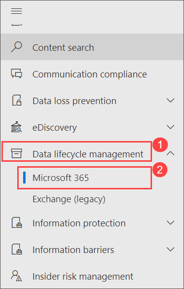

1. On the **Data lifecycle management** page, in the **Retention policies** tab select **+ New retention policy**.
    

1. On the **Name your retention policy** page, for the **Name** enter **Retention policies** and  click **Next**.

      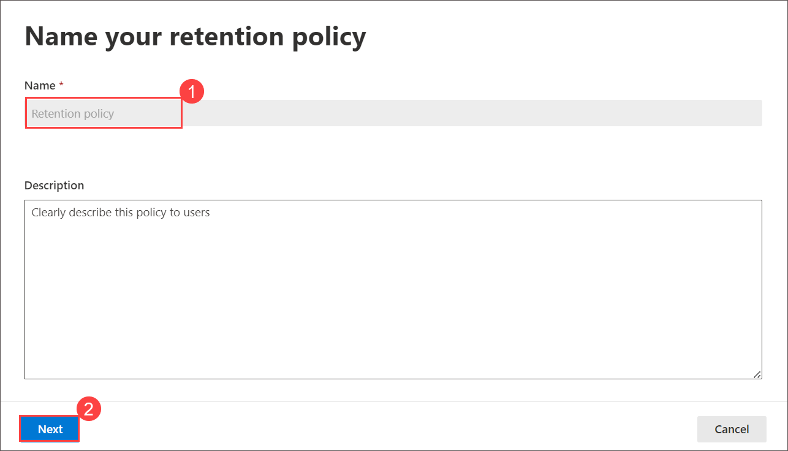

1. On the **Policy Scope** page select **Next**.

   

1. In the **Choose the type of retention policy to create** area, select **Static** then select **Next**.

   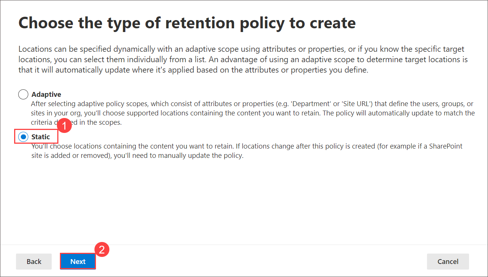

1. In the **Choose where to apply this policy** enable and select **Next**.

   - **Exchange mailboxes**
   - **SharePoint classic and communication sites**
   - **OneDrive accounts**
   - **Microsoft 365 Group mailboxes & sites**

     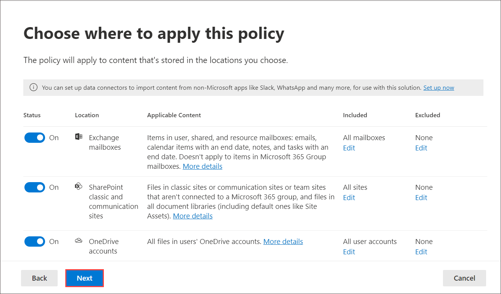

1. On the **Decide if you want to retain content, delete it, or both** page, for the **Retain items for a specific period** section, enter the following information and select **Next**.

   - **Retain items for a specific period**: Choose **Custom** from the dropdown list.
   - Change the years field to **0**, month field to **0** and days to **1**.
   - **Start the retention period based on**: When items were last modified.
   - **At the end of the retention period**: Delete items automatically.

      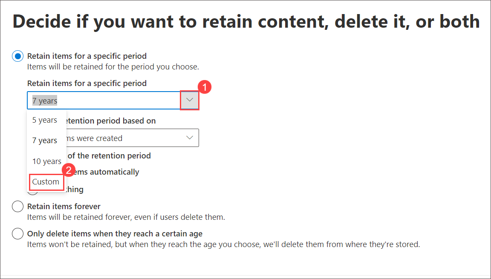
      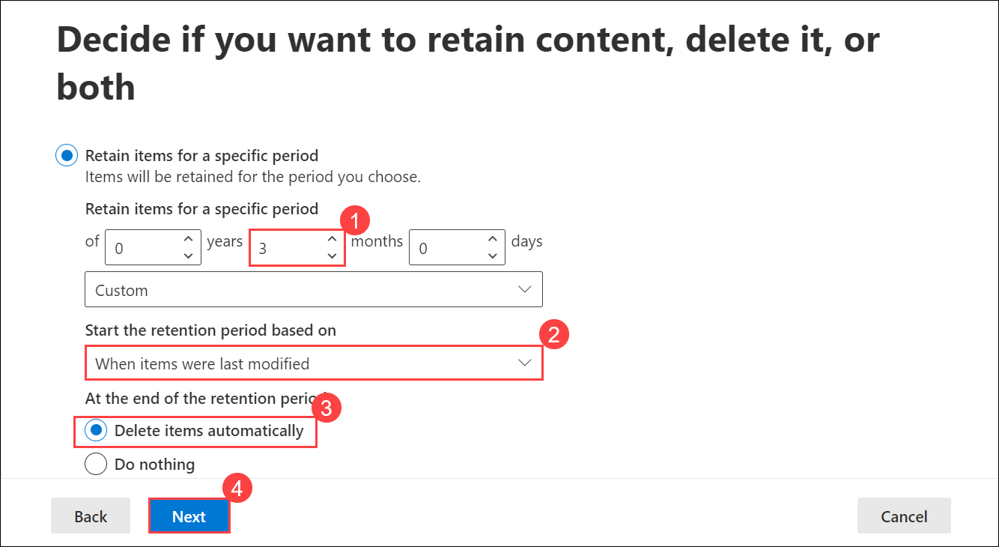

1. On the **Review and finish** page select **Submit**.

    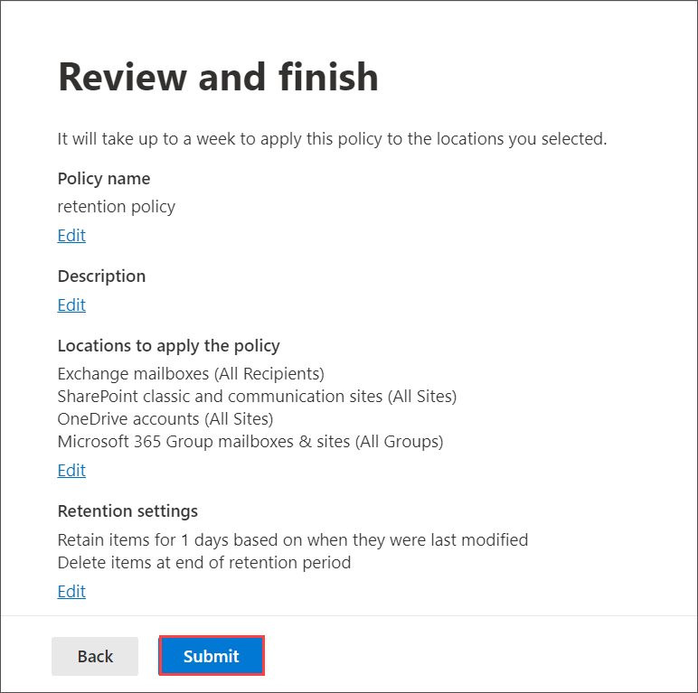

1. Once your policy is created select **Done**.

You have successfully created a retention policy for the Exchange email, Microsoft 365 groups, OneDrive, and SharePoint sites locations. This retention policy will retain items in these locations for three years from when the item was last modified date. This policy can take up to 24 hours to be apply in your tenant, but you can proceed to the next step.

## Task 2 – Create Retention Policy with Adaptive scope

In this exercise you will create a retention policy for the finance and legal department. The purpose of the policy is to comply with the law, retaining all legal related documents for 5 years. First you will create an adaptive scope including the legal and the retail department, then you will create a retention policy using this scope.

1. In **Microsoft Edge**, navigate to **https://compliance.microsoft.com**.

1. In the **Microsoft Purview** portal on the left navigation pane expand **Roles & scopes** then select **Adaptive scopes**.

   

1. On the **Adaptive scopes** page select **+ Create scope**.

   

1. On the **Name your adaptive policy scope** page input and select **Next**.

    - **Name**: Legal Documents Retention
    - **Description**: Retention for legal related documents

       

1. On the **Assign admin unit** page select **Next**.

    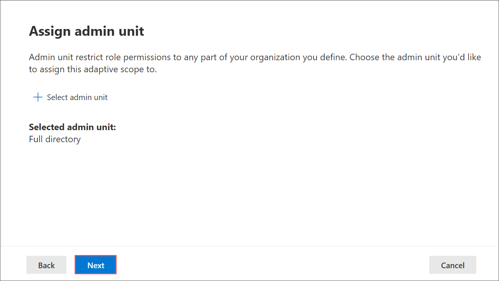

1. On the **What type of scope do you want to create?** page select **Users** then select **Next**.

    

1. On the **Create the query to define users** page, under **User attributes** sepcify the following:
    
    - Select the drop-down menu for **Attribute** then select **Department**.
    - Attribute field select **is equal to** as the operator.
    - Enter **Legal** in the **Value** field.

1. To add a second attribute, select **+ Add attribute** on the **Create the query to define users** page.

    

1. For the **Query operator**, **Attribute**, **Operator**, and **Value** input, ensure the checkboxes are selected next to each attribute then select **Next**.

   - **Query operator**: Or
   - **Attribute**: Department
   - **Operator**: is equal to
   - **Value**: Retail

   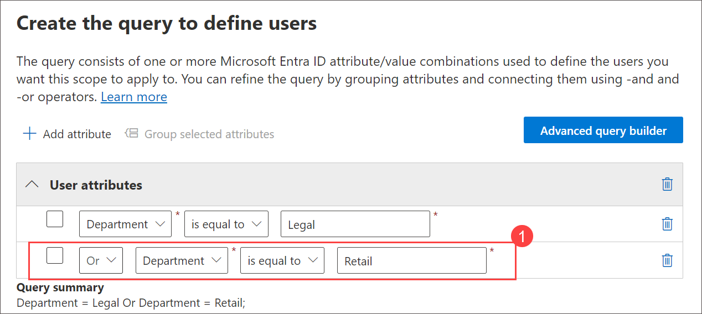

1. Ensure the checkboxes are selected next to each attribute then select **Next**.
    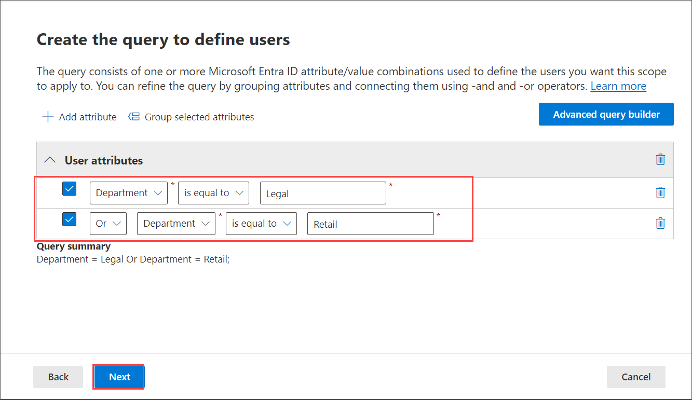

1. On the **Review and finish** page select **Submit**.

    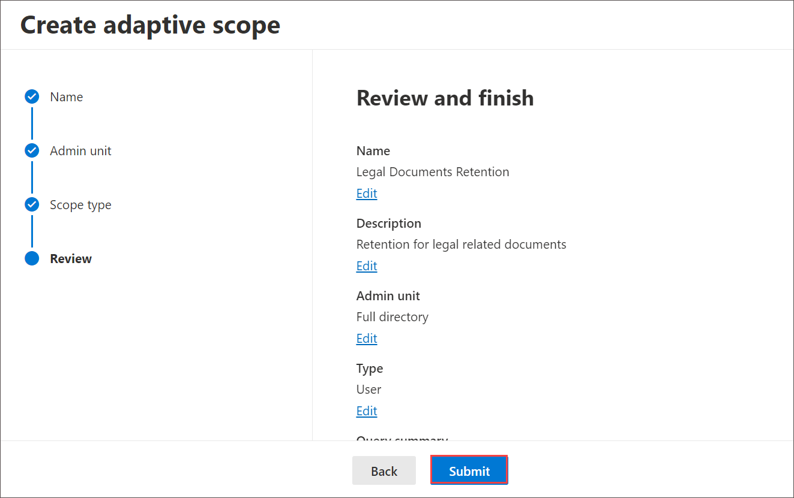

1. On the **Your scope was created page** select **Done**.

1. In the **Microsoft Purview** portal, in the left navigation pane, expand **Data lifecycle management** then select **Microsoft 365**.

1. On the **Data lifecycle management** page select the **Retention policies** tab then select **+ New retention policy**.

1. On the **Name your retention policy** page input and select **Next**.

    - **Name**: Legal Data Retention
    - **Description**: Retention of all documents within the legal and retail departments.

      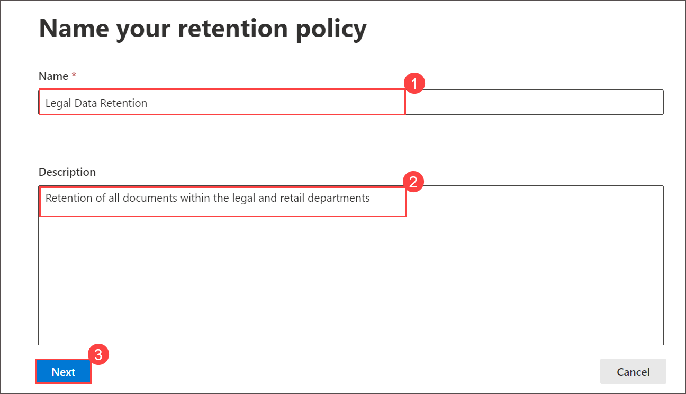

1. On the **Policy Scope** page select **Next**.

   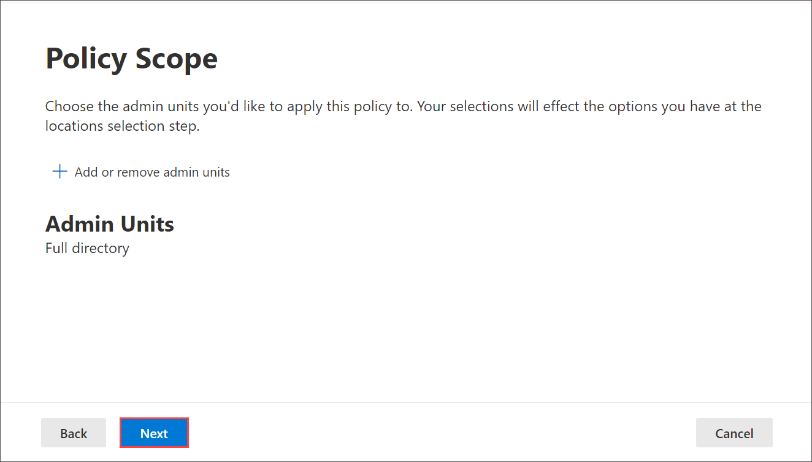

1. On the **Choose the type of retention policy to create** page select **Adaptive** then select **Next**.

   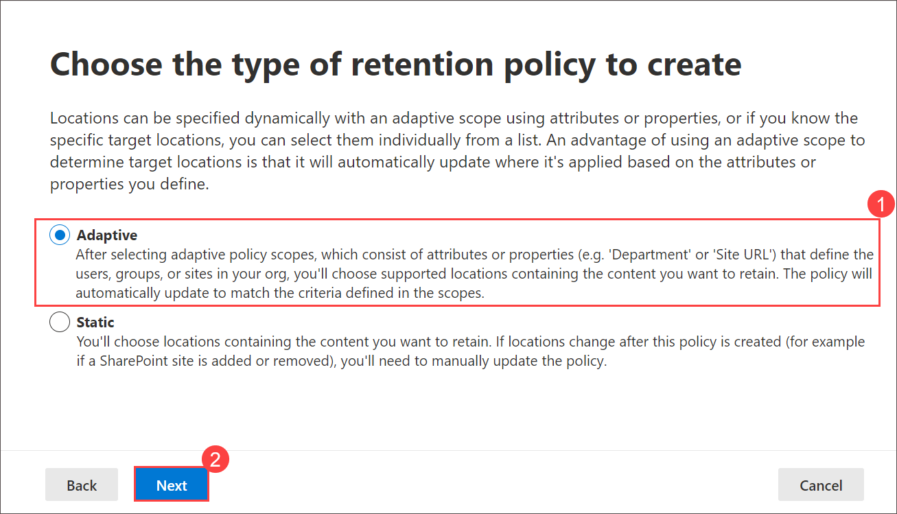

1. On the **Choose adaptive policy scopes and locations** page select **+ Add scopes** and in the right flyout **Choose adaptive policy scopes** page select the checkbox for **Legal Documents Retention** then select the **Add** button.

     

1. Back on the **Choose locations to apply the policy** enable and select **Next**.

    - **Exchange mailboxes**
    - **OneDrive accounts**
    - Leave all other locations disabled.
 
      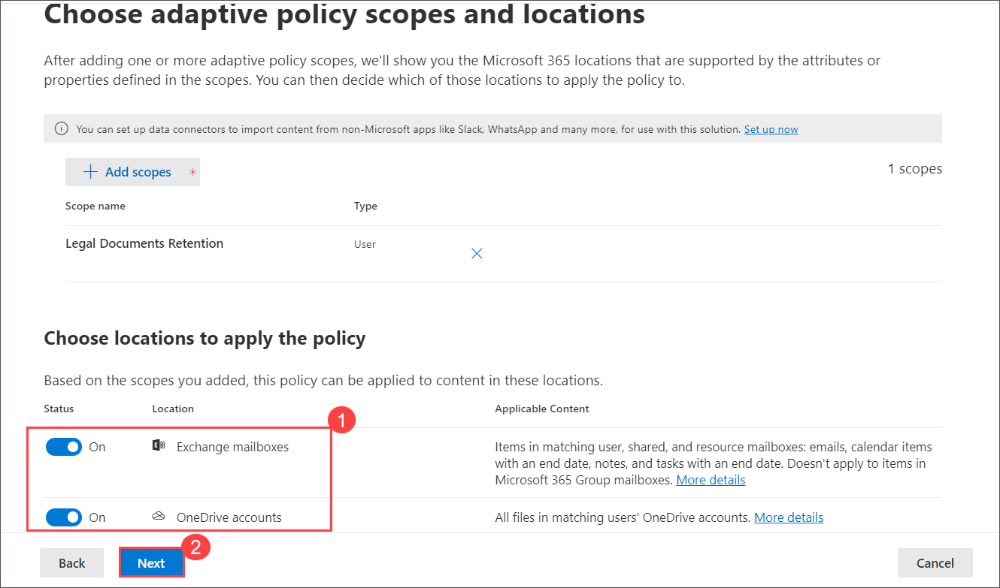

1. On the **Decide if you want to retain content, delete it, or both** page, for the **Retain items for a specific period** section input and select **Next**.

    - **Retain items for a specific period**: Choose **Custom** from the dropdown list.
    -  Change the **years** field to **0**, **month** field to **0** and **days** to **1**.
    - **Start the retention period based on**: When items were created
    - **At the end of the retention period**: Do nothing

        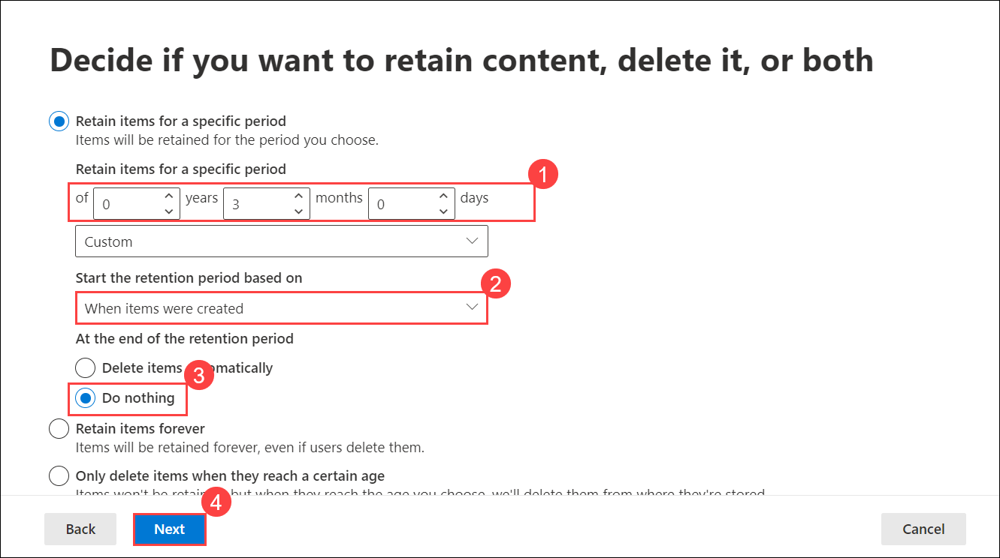

1. On the **Review and finish** page select **Submit**.

    

1. Once your policy is created, select the **Done** button.

1. On the **You successfully created a retention policy** page select **Done**.

You have successfully applied an adaptive scope to a retention policy.
