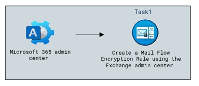

# Part:1 Lab 03 - Configure EAC rule to enable encryption

# Lab scenario

In this lab, you will take on the persona of Holly Dickson, Adatum’s Security Administrator. You have been tasked with piloting the use of Microsoft 365 message encryption in Adatum’s Microsoft 365 deployment.

In this lab you will set up Azure Rights Management for your tenant. You will also learn how to create a mail flow encryption rule using the Exchange Admin Center.

## Lab objectives

In this lab, you will complete the following task:

+ Task 1: Create a Mail Flow Encryption Rule using the Exchange admin center

## Architecture diagram

### Task 1 – Create a Mail Flow Encryption Rule using the Exchange admin center

In this task, you will create an encryption rule for messages inside your Exchange Online environment by using the Exchange admin center. 

1. On the **Lab-instance** VM, you should still be logged into the Microsoft 365 admin center as lab user. If you closed your Edge browser or the Microsoft 365 admin center tab, then in Microsoft Edge navigate to `https://portal.office.com` and sign in as **labuser@M365xZZZZZZ.onmicrosoft.com** (where ZZZZZZ is your unique tenant ID) and the password that provided you on the environment details page. 

1. Return to the **Microsoft 365 admin center** `https://admin.microsoft.com/` > **Show all** > **Exchange**. This will open the Exchange admin center.

1. In the **Exchange admin center**, select **Mail flow** > **Rules** > **+ Add a rule** > **Create a new rule**.

1. In the **Set rule conditions** window, in the **Name** box, enter `Encrypt mail for guest@contoso.com` as the name of this rule.

1. Select the drop-down arrow in the **Apply this rule if** condition box. In the drop-down menu, select **the recipient** and **is this person**. 

1. For this condition, you must either select an existing name from the contact list or type a new email address in the **check names** box. In this case, enter `labuser@M365xZZZZZZ.onmicrosoft.com` in the **Check names** box and then select **OK**.

1. You need to add more conditions, so click the **+** to the right.

1. Under **And** select **The recipient** and **is external/internal**. In the blade that opens to the right, select **Outside the organization** > **Save**.

1. You now need to define an action to perform when this rule is applied. Under **Do the following…**, select **Modify the message security….** and **Apply Microsoft 365 Message Encryption and rights protection.**

1. In the **select RMS template** dialog box, select **Encrypt** > **Save**. Click **Next**.
1. On the **Set rule settings** window, click the checkbox next to **Activate this rule on**. That should automatically populate a date and time that will make the rule take effect immediately upon completion. Click **Next** > **Finish** > **Done**.
1. In the **Rules** window, click the name of the rule under the **Rules** column. In the window that opens to the right, click the toggle under **Enable or disable rule** to enable the rule. Close the window.
1. Leave your browser session open for the next exercise.

## Review
In this lab, you will complete the following task:
+ Create a Mail Flow Encryption Rule using the Exchange admin center
