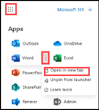
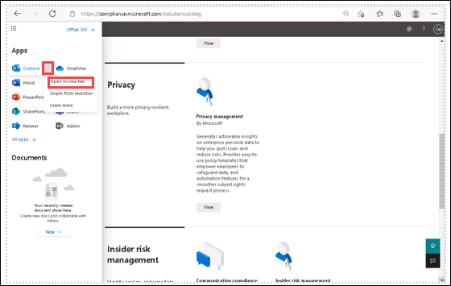

# Part-2 lab 2 - Protect Sensitive Data 

## Lab scenario
In this lab, you will get know how on what are the basic primary steps to protect the sensitive data.

## Lab objectives

In this lab, you will complete the following tasks:

+ Task 1: How to apply a label
+ Task 2: Impact of that label

### Protecting your data using Microsoft Purview 

1. In the Search bar of the browser, type *https://compliance.microsoft.com/homepage*, then  sign in using the **credentials** provided to you duing the lab.

1. you can protect your sensitive data using **Sensitivity label, Encryption messages and documents, Microsoft Defender, Microsoft Information Protection SDK extension for web browser, Data classification**.

We will take a look into how they work in preceding labs and providing brief information about the steps to configure.

## Task 1: How to apply a label
In this task, you will go through the process of applying a label from the perspective of the user (in this case the user is the admin) and view the content marking that is generated by the label.

1. From the Microsoft Purview home page, select the **app launcher icon**, and **right click on the Word icon** and select **Open in new tab**. 

    

1. Select **blank document**, then enter some text on the page.  On the blue bar on the top of the page, select the down-arrow, next to where it says DocumentXX - Saved, and in the File Name box enter, **Test-label**.

1. From the top menu bar, select **Sensitivity**.(**Note**: If the option is not available, it will take sometime to reflect Alternatively try refreshing the page or sign-out and sign-in again) From the drop down select **Confidential-Finance**

            

1. From the top menu bar, select **View**, then select **Reading view**.

                  

1. Notice how the document includes the watermark.  

1. Close the Microsoft Word tabs that are open on your browser to exit from Word.

## Task 2 (optional): Impact of that label
In addition to content marking, the label protection setting was set for encryption. Per the permissions that were configured with this label, members of the finance group can co-author documents with this label applied and users in the Contoso tenant can view (or any document/email with the label applied).  In this task you will send this document to an email address to which you have access (ie., a personal email address) and that is NOT part of the WWLxZZZZ.OnMicrosoft.com domain and see what happens when you try to open the attachment.  

1. From the Microsoft Purview home page, select the **app launcher icon**, and **right click on the Outlook icon** and select **Open in new tab**.

      

1. Select **New Email** from the top left corner of the screen.  Enter an email address to which you have access and is not part of the WWLxZZZZ.OnMicrosoft.com domain and enter **Test** in the subject line.

1. Select **Attach**.

1. Select **One drive**.

1. From the list that shows up, select the document you created and to which you applied the label **Test-label**. Select **Next** and select **Attach as a copy**.  Press **Send**.

1. Check the email to which you sent the document.  Note, the email may be directed to your junk folder.  When you attempt to open the attached word file you will see a notification that you do not have permission to open the document.

1. Close the open browser tabs.

