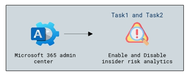

# Part:2 Lab 06 - Explore Insider Risk Management in Microsoft Purview

## Lab scenario
In this lab, you will explore the capabilities of Insider Risk Management to identify, mitigate, and respond to potential risks posed by individuals within the organization

## Lab objectives

In this lab, you will complete the following tasks:

+ Task 1: Enable insider risk analytics.
+ Task 2: Disable insider risk analytics

## Architecture diagram

### Task 1: Enable insider risk analytics
In this task you, as the global administrator, will enable permissions for Insider Risk Management.  Specifically, you will add users to the Insider Risk Management role group to ensure that designated users can access and manage insider risk management features. 

  **To enable insider risk analytics**:

1. Sign in on Microsoft Purview, go to **Insider risk management**.
 
    
1. Select **Run scan** on the **Scan for insider risks in your organization** card on the insider risk management Overview tab. This action turns on analytics scanning for your 
   organization. You can also turn on scanning in your organization by navigating to **Insider risk settings** > **Analytics** and enabling **Scan your tenant's user activity to 
   identify potential insider risks**.

1. On the **Analytics details** pane, select **Run scan to start the scan for your organization**. Analytics scan results may take up to **48 hours** before insights are available as 
   reports for review.

### Task 2: Disable insider risk analytics

   **To turn off analytics**:
   
1. In the **Microsoft Purview compliance portal**, go to **Insider risk management**.

2. Select the **Settings button**, and then select **Analytics**.

3. On the **Analytics** page, turn the setting to **off**.

## Review
In this lab, you will complete the following tasks:
+ Enable insider risk analytics.
+ Disable insider risk analytics
