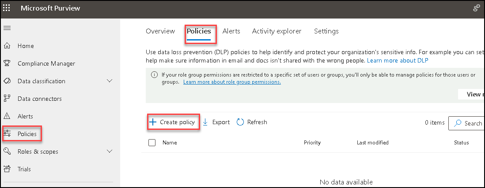
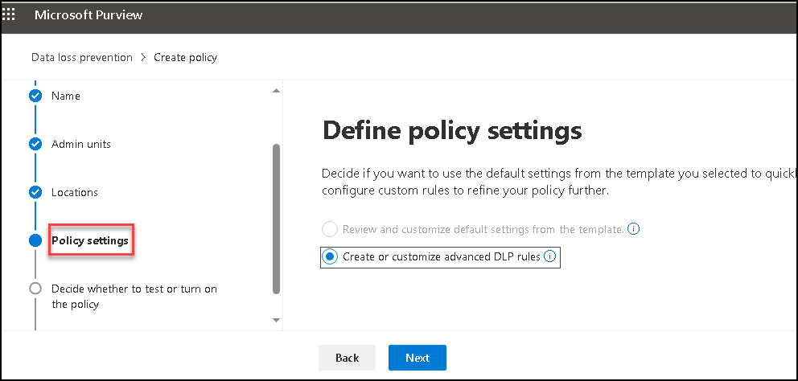
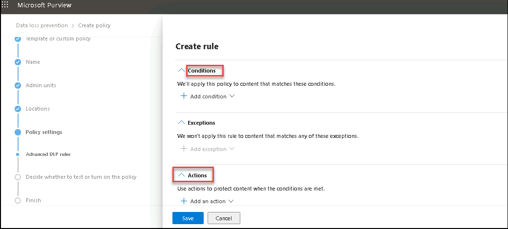

# DLP Alerts > Alerts remediations 

## Lab scenario
In this lab, you will explore on how to remediate a DLP alert if any user does not adhere the policies.

## Lab objectives

In this lab, you will complete the following tasks:

+ Task 1: Create DLP policy to Mitigate the risk of data loss and encrypt the data
+ Task 2: Reset password
+ Task 3: Disable account
+ Task 4: educate user

### Task 1 – Create DLP policy to Mitigate the risk of data loss and encrypt the data

1. Click on the **Policies** and click on create Policy and fill the details according learned in previous labs for DLP.

   

1. Click on policy Settings Select **Create or Customize the advanced DLP rules**.

   

1. In the Advanced DLP Rules tab on Create rule page you will get conditions and actions based on what condition the action should apply

   

   

   

**you can also manually perform the activities once received suspicious alerts**.

### Task 2 - Reset password

**Sign in to the Microsoft 365 Admin Center**:

1. Open a web browser and go to **https://admin.microsoft.com/**
  Sign in with your admin credentials.

1. Navigate to Users:
   In the admin center, go to **Users** or **Active users** depending on your interface version.
   **Select the User**

1. Find and select the user account for which you want to reset the password.
   **Reset Password**

1. Look for an option like **Reset password** or **Change password**
   Follow the on-screen prompts to enter a new password for the user.

1. Notify User:
   Optionally, inform the user of their new password or advise them to reset it upon their next login.

  
### Task 3 - Disable account

1. Find and select the user account that you want to disable in microsoft office portal.
  **Disable the Account**

1. Look for an option like **Disable account** or **Block sign-in**
  Click on the option to **disable** the user account.
  Confirm the Action

1. Confirm the action to disable the account. Depending on your settings, you may have the option to provide a reason for disabling the account.

### Task 4 - educate user

1. After disabling the user or resetting the password. we can connect with user to educate on activities and what should do to avoid.
