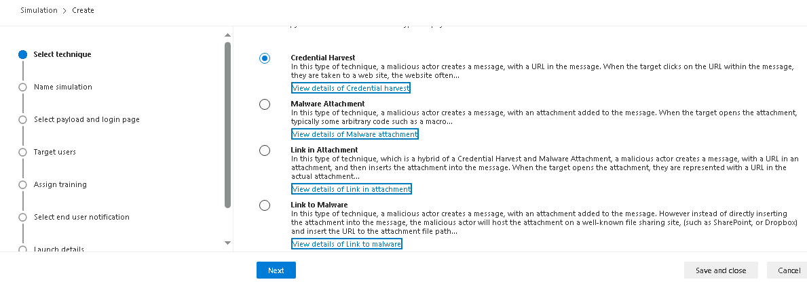
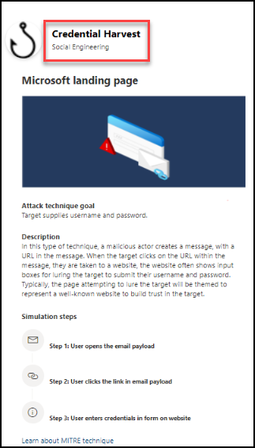
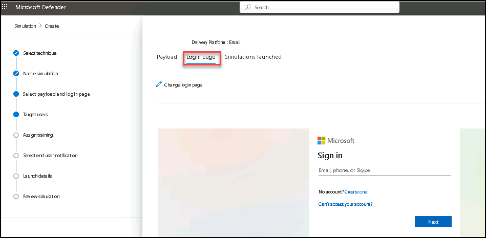
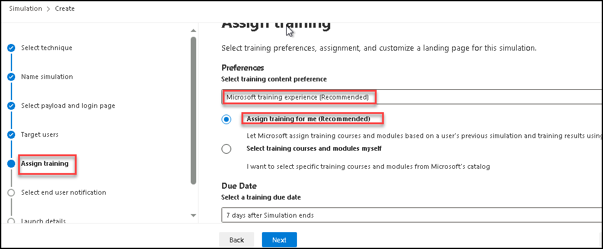
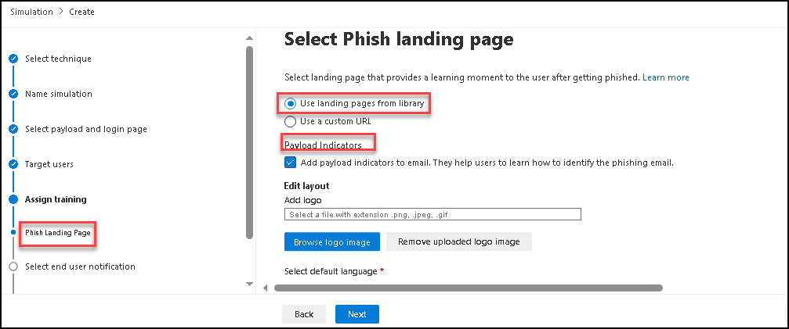
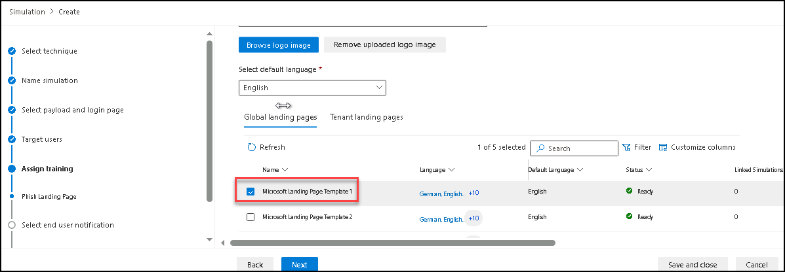
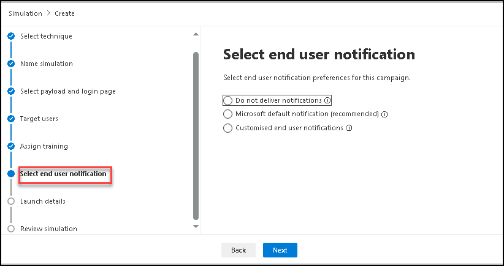
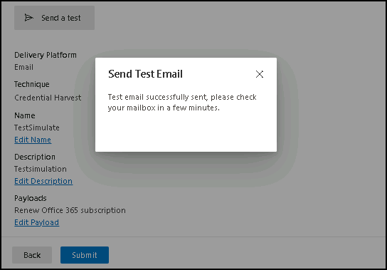
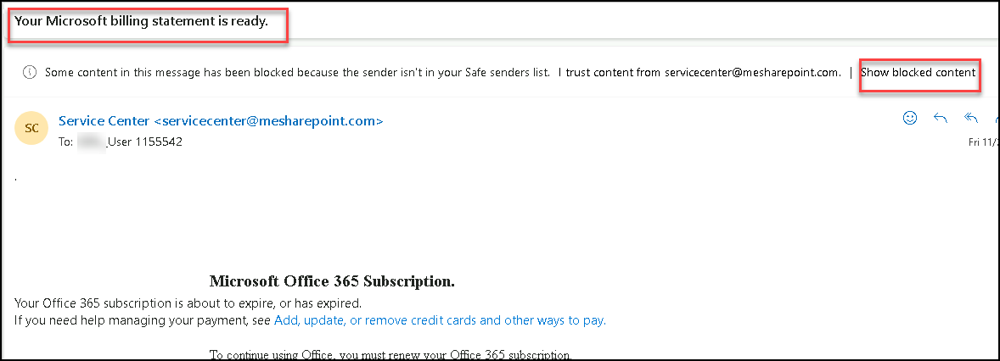

# Excercise 7 - Safe breach simulation

## Lab scenario
In this lab, you will explore how the simulations are benign cyberattacks that you run in your organization. These simulations test your security policies and practices, as well as train your employees to increase their awareness and decrease their susceptibility to attacks.

## Lab objectives

In this lab, you will complete the following tasks:

+ Task : Create Attack Simulation

## Task 1: Create Attack Simulation

To launch a simulated phishing attack, do the following steps:

1. In the Microsoft Defender portal at **https://security.microsoft.com**, go to **Email & collaboration** > **Attack simulation 
   training** > **Simulations tab**. 

1. On the Simulations tab, select  **Launch a simulation** to start the new simulation wizard.

    
   

1. Select the social engineering technique you want to use with this simulation.

   

   

1. On the **Name simulation** page, configure the following settings:

   **Name**: Enter a unique, descriptive name for the simulation.
   **Description**: Enter an optional detailed description for the simulation.

1. When you're finished on the **Name simulation** page, select **Next**.

1. Select a **Payload** > For built-in payloads, the value is **Global**. For custom payloads, the value is **Tenant**.

   

   

1. Payload **Renew Office 365 subscription** click on **Next**.

1. On the **Target users** page, select who receives the simulation. Use the following options to select users - **Include all users in 
   your organization**: The unmodifiable list of users is show in groups of 10. OR **Include only specific users and groups**: At 
   first, no users or groups are shown on the Targeted users page. To add users or groups to the simulation, choose one of the following 
   options

   

1. On the Training assignment page, select the trainings that you want to add to the simulation by clickling on the **Training 
   preference** > Select the Training as **Recommeded Microsoft Training** > Select **assign training for me**.

   
   

1. Select the Training Due Date for the Simulation and click on **Next**

1. On the **Selecting phish landing page**, you configure the web page that users are taken to if they open the payload in the simulation.

1. Use landing pages from library: The following options are available:

   **Payload indicators**: Select Add payload indicators to email to help users learn how do identify phishing email.

Note: This setting is not available if you selected Malware Attachment or Link to Malware on the Select a social engineering technique page.

   
   

   

1. **Global landing pages tab**: Contains the built-in landing pages. When you select a built-in landing page to use by selecting the 
   check box next to name, an Edit layout section appears with the following options:
  **Select default language**: This setting is required. Select one of the following values: Chinese (Simplified), Chinese 
    (Traditional),English, French, German, Italian, Japanese, Korean, Portuguese, Russian, Spanish, and Dutch.

1. On the **Select end user notification page**, select from the following notification options:

   **Do not deliver notifications**: No other configuration options are available on the page. Users will not receive Training 
     assignment notifications, Training reminder notifications or Positive reinforcement notifications from the simulation.

   **Microsoft default notification (recommended)**: The notifications that users will receive are shown on the page:

   **Microsoft default positive reinforcement notification** - **Deliver During Simulation**
   
   **Microsoft default training assignment notification** - **Not Applicable**
   
   **Microsoft default training reminder notification** - **Twice A Week**

    

    

1. On the **Launch details page**, you choose when to start and end the simulation. We'll stop capturing interaction with this 
   simulation after the end date you specify.

1. Choose one of the following values:

   **Launch this simulation as soon as I'm done**

   **Schedule this simulation to be launched later**: This value has the following associated options to configure:

   **Select launch date**
   **Select launch time hour**
   **Select launch time minute**
   **Select time format: Select AM or PM**
   
   The default value for Configure number of days to end simulation after is 2 days, which is also the minimum value. The maximum value 
   is 30 days.

   If you select **Enable region aware time zone delivery**, the simulated attack messages are delivered to users during their regional 
   working hours.

   

   When you're finished on the **Launch details page**, select **Next**.

1. On the **Review simulation page**, you can review the details of the simulation.

   Select the  **Send a test** button to send a copy of the payload email to yourself (the currently logged in user) for inspection.

   

    

    

   You can select Edit in each section to modify the settings within the section. Or you can select Back or the specific page in the 
   wizard to modify the settings.

   When you're finished on the Review simulation page, select **Submit**.

